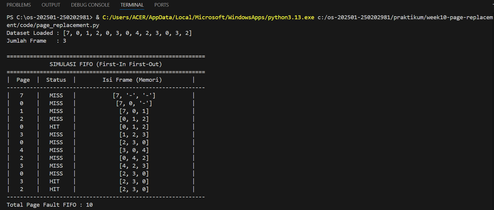
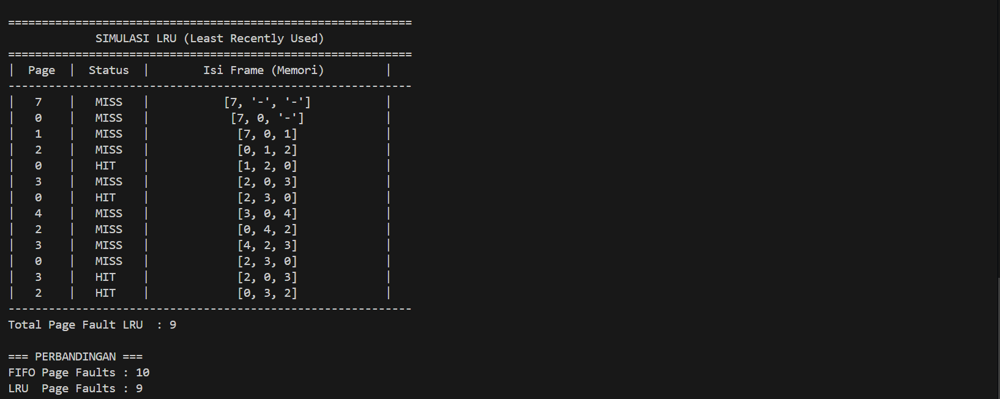

# Laporan Praktikum Minggu [10]
Topik: ["Manajemen Memori – Page Replacement (FIFO & LRU)"]

---

## Identitas
- **Nama**  : [Nisa'ul Hidayah]  
- **NIM**   : [25020981]  
- **Kelas** : [1IKRB]

---

## Tujuan
1. Mengimplementasikan algoritma page replacement FIFO dalam program.
2. Mengimplementasikan algoritma page replacement LRU dalam program.
3. Menjalankan simulasi page replacement dengan dataset tertentu.
4. Membandingkan performa FIFO dan LRU berdasarkan jumlah *page fault*.
5. Menyajikan hasil simulasi dalam laporan yang sistematis.

---

## Dasar Teori
1. Manajemen memori merupakan salah satu fungsi utama sistem operasi yang bertugas mengatur penggunaan memori utama agar dapat digunakan secara efisien oleh berbagai proses. Dalam sistem memori virtual, data dan instruksi disimpan dalam bentuk halaman (page) yang akan dimuat ke dalam memori utama ketika dibutuhkan. Apabila halaman yang diminta tidak tersedia di memori utama, maka akan terjadi page fault, sehingga sistem operasi harus melakukan penggantian halaman (page replacement).
2. Algoritma FIFO (First In First Out) adalah metode penggantian halaman yang mengganti halaman yang pertama kali masuk ke dalam memori tanpa mempertimbangkan apakah halaman tersebut masih sering digunakan atau tidak. Algoritma ini sederhana dalam implementasi, namun kurang efisien karena tidak memperhatikan pola akses halaman.
3. Algoritma LRU (Least Recently Used) mengganti halaman yang paling lama tidak diakses. Algoritma ini mengasumsikan bahwa halaman yang jarang digunakan di masa lalu kemungkinan besar juga jarang digunakan di masa depan. Oleh karena itu, LRU umumnya menghasilkan jumlah page fault yang lebih sedikit dibandingkan FIFO, meskipun implementasinya lebih kompleks.
---

## Langkah Praktikum
1. **Menyiapkan Dataset**

   Gunakan *reference string* berikut sebagai contoh:
   ```
   7, 0, 1, 2, 0, 3, 0, 4, 2, 3, 0, 3, 2
   ```
   Jumlah frame memori: **3 frame**.

2. **Implementasi FIFO**

   - Simulasikan penggantian halaman menggunakan algoritma FIFO.
   - Catat setiap *page hit* dan *page fault*.
   - Hitung total *page fault*.

3. **Implementasi LRU**

   - Simulasikan penggantian halaman menggunakan algoritma LRU.
   - Catat setiap *page hit* dan *page fault*.
   - Hitung total *page fault*.

4. **Eksekusi & Validasi**

   - Jalankan program untuk FIFO dan LRU.
   - Pastikan hasil simulasi logis dan konsisten.
   - Simpan screenshot hasil eksekusi.

5. **Analisis Perbandingan**

   Buat tabel perbandingan seperti berikut:

   | Algoritma | Jumlah Page Fault | Keterangan |
   |:--|:--:|:--|
   | FIFO | ... | ... |
   | LRU | ... | ... |


   - Jelaskan mengapa jumlah *page fault* bisa berbeda.
   - Analisis algoritma mana yang lebih efisien dan alasannya.

6. **Commit & Push**

   ```bash
   git add .
   git commit -m "Minggu 10 - Page Replacement FIFO & LRU"
   git push origin main
   ```

---

## Kode / Perintah
Tuliskan potongan kode atau perintah utama:
```bash
def print_header(title):
    print("\n" + "=" * 60)
    print(f"{title:^60}")
    print("=" * 60)
    print(f"| {'Page':^6} | {'Status':^8} | {'Isi Frame (Memori)':^33} |")
    print("-" * 60)


def fifo(pages, frame_size):
    frame = []
    page_fault = 0

    print_header("SIMULASI FIFO (First-In First-Out)")

    for page in pages:
        if page in frame:
            status = "HIT"
        else:
            status = "MISS"
            page_fault += 1
            if len(frame) < frame_size:
                frame.append(page)
            else:
                frame.pop(0)
                frame.append(page)

        tampilan = frame + ["-"] * (frame_size - len(frame))
        print(f"| {page:^6} | {status:^8} | {str(tampilan):^33} |")

    print("-" * 60)
    print(f"Total Page Fault FIFO : {page_fault}")
    return page_fault

def lru(pages, frame_size):
    frame = []
    page_fault = 0

    print_header("SIMULASI LRU (Least Recently Used)")

    for page in pages:
        if page in frame:
            status = "HIT"
            frame.remove(page)
            frame.append(page)
        else:
            status = "MISS"
            page_fault += 1
            if len(frame) < frame_size:
                frame.append(page)
            else:
                frame.pop(0)
                frame.append(page)

        tampilan = frame + ["-"] * (frame_size - len(frame))
        print(f"| {page:^6} | {status:^8} | {str(tampilan):^33} |")

    print("-" * 60)
    print(f"Total Page Fault LRU  : {page_fault}")
    return page_fault

# ===================== MAIN PROGRAM =====================
if __name__ == "__main__":
    pages = [7, 0, 1, 2, 0, 3, 0, 4, 2, 3, 0, 3, 2]
    frame_size = 3

    print("Dataset Loaded :", pages)
    print("Jumlah Frame   :", frame_size)

    fifo_fault = fifo(pages, frame_size)
    lru_fault = lru(pages, frame_size)

    print("\n=== PERBANDINGAN ===")
    print(f"FIFO Page Faults : {fifo_fault}")
    print(f"LRU  Page Faults : {lru_fault}")
```

---

## Hasil Eksekusi
Sertakan screenshot hasil percobaan atau diagram:



---

## Analisis
- Tabel Perbandingan.
   | Algoritma | Jumlah Page Fault | Keterangan |
   |:--|:--:|:--|
   | FIFO | 10 | Mengganti halaman yang pertama kali masuk ke memori tanpa memperhatikan apakah halaman tersebut masih sering digunakan. |
   | LRU | 9 | Mengganti halaman yang paling lama tidak digunakan berdasarkan riwayat akses halaman. | 
- Jelaskan mengapa jumlah *page fault* bisa berbeda.
Perbedaan jumlah page fault antara FIFO dan LRU terjadi karena cara pemilihan halaman yang akan diganti. Pada algoritma FIFO hanya melihat urutan kedatangan halaman, sehingga halaman yang sebenarnya masih dibutuhkan bisa terhapus lebih awal. Hal ini dapat menyebabkan page fault lebih banyak. Sedangkan, algoritma LRU mempertimbangkan pola penggunaan halaman, yaitu mengganti halaman yang paling lama tidak diakses. 
- Analisis algoritma mana yang lebih efisien dan alasannya.
Berdasarkan hasil percobaan, algoritma LRU lebih efisien dibandingkan FIFO karena LRU menghasilkan jumlah page fault yang lebih sedikit dibandingkan dengan FIFO. Hal ini menunjukkan bahwa LRU lebih mampu menyesuaikan diri dengan pola akses halaman yang bersifat lokalitas. 

---

## Kesimpulan
1. Algoritma page replacement FIFO dan LRU memiliki cara kerja yang berbeda dalam menentukan halaman yang akan diganti saat terjadi page fault, sehingga menghasilkan jumlah page fault yang berbeda pada dataset yang sama.
2. Hasil simulasi menunjukkan bahwa algoritma LRU lebih efisien dibanding FIFO karena mampu mempertahankan halaman yang sering digunakan lebih lama di memori.
3. Simulasi page replacement membantu memahami secara praktis konsep manajemen memori virtual dan dampak pemilihan algoritma terhadap kinerja sistem operasi.
---

## Quiz
1. [Apa perbedaan utama FIFO dan LRU?]  
   **Jawaban: Perbedaan utama FIFO dan LRU terletak pada cara menentukan halaman yang akan diganti. FIFO mengganti halaman yang pertama kali masuk ke memori, sedangkan LRU mengganti halaman yang paling lama tidak digunakan berdasarkan riwayat akses.**  
2. [Mengapa FIFO dapat menghasilkan *Belady’s Anomaly*?]  
   **Jawaban: FIFO dapat menghasilkan Belady’s Anomaly karena FIFO tidak mempertimbangkan sebrapa sering atau seberapa baru sebuah halaman memori diakses, melainkan hanya kapan halaman tersebut dimuat ke dalam memori.**  
3. [Mengapa LRU umumnya menghasilkan performa lebih baik dibanding FIFO?]  
   **Jawaban: LRU umumnya menghasilkan performa lebih baik karena mempertimbangkan prinsip locality of reference, khususnya temporal locality. Halaman yang baru diakses cenderung akan digunakan kembali, sehingga dengan mempertahankan halaman tersebut di memori, LRU dapat mengurangi jumlah page fault dibandingkan FIFO.**  

---

## Refleksi Diri
Tuliskan secara singkat:
- Apa bagian yang paling menantang minggu ini?  
Memahami alur kerja algoritma page replacement.
- Bagaimana cara Anda mengatasinya?  
Solusinya melakukan pemeriksaan langkah demi langkah pada setiap refrensi halaman dan menccocokannya dengan teori.
---

**Credit:**  
_Template laporan praktikum Sistem Operasi (SO-202501) – Universitas Putra Bangsa_
