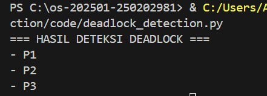

# Laporan Praktikum Minggu [11]
Topik: [Simulasi dan Deteksi Deadlock]

---

## Identitas
- **Nama**  : [Nisa'ul Hidayah]  
- **NIM**   : [250202981]  
- **Kelas** : [1IKRB]

---

## Tujuan
1. Membuat program sederhana untuk mendeteksi deadlock.  
2. Menjalankan simulasi deteksi deadlock dengan dataset uji.  
3. Menyajikan hasil analisis deadlock dalam bentuk tabel.  
4. Memberikan interpretasi hasil uji secara logis dan sistematis.  
5. Menyusun laporan praktikum sesuai format yang ditentukan.

---

## Dasar Teori

**Pengertian** 
- Deadlock adalah kondisi di mana dua atau lebih proses dalam sistem komputer saling menunggu untuk melepaskan sumber daya yang sedang mereka pegang, sehingga tidak ada proses yang bisa melanjutkan eksekusinya, menciptakan kebuntuan atau "macet".

**Konsep Deteksi Deadlock**
- Deteksi deadlock adalah pendekatan yang membiarkan deadlock terjadi, kemudian sistem melakukan pemeriksaan untuk mengidentifikasi adanya deadlock serta proses-proses yang terlibat di dalamnya.

**Empat Kondisi Deadlock**
- Deadlock terjadi jika keempat kondisi berikut terpenuhi secara bersamaan: mutual exclusion, hold and wait, no preemption, dan circular wait. Deteksi deadlock bertujuan menemukan kondisi circular wait dalam sistem.

---

## Langkah Praktikum
1. **Menyiapkan Dataset**

   Gunakan dataset sederhana yang berisi:
   - Daftar proses  
   - Resource Allocation  
   - Resource Request / Need

   Contoh tabel:

   | Proses | Allocation | Request |
   |:--:|:--:|:--:|
   | P1 | R1 | R2 |
   | P2 | R2 | R3 |
   | P3 | R3 | R1 |

2. **Implementasi Algoritma Deteksi Deadlock**

   Program minimal harus:
   - Membaca data proses dan resource.  
   - Menentukan apakah sistem berada dalam kondisi deadlock.  
   - Menampilkan proses mana saja yang terlibat deadlock.

3. **Eksekusi & Validasi**

   - Jalankan program dengan dataset uji.  
   - Validasi hasil deteksi dengan analisis manual/logis.  
   - Simpan hasil eksekusi dalam bentuk screenshot.

4. **Analisis Hasil**

   - Sajikan hasil deteksi dalam tabel (proses deadlock / tidak).  
   - Jelaskan mengapa deadlock terjadi atau tidak terjadi.  
   - Kaitkan hasil dengan teori deadlock (empat kondisi).

5. **Commit & Push**

   ```bash
   git add .
   git commit -m "Minggu 11 - Deadlock Detection"
   git push origin main
   ```

---

## Kode / Perintah
Tuliskan potongan kode atau perintah utama:
```bash
import csv

process = []
allocation = {}
request = {}

# Membaca dataset
with open("dataset_deadlock.csv") as file:
    reader = csv.DictReader(file)
    for row in reader:
        p = row["Process"]
        process.append(p)
        allocation[p] = row["Allocation"]
        request[p] = row["Request"]

deadlock_process = []

# Deteksi daedlock
for p1 in process:
    p2 = None
    p3 = None

    for x in process:
        if allocation[x] == request[p1]:
            p2 = x

    if p2:
        for y in process:
            if allocation[y] == request[p2] and request[y] == allocation[p1]:
                p3 = y

    if p2 and p3:
        deadlock_process.extend([p1, p2, p3])

deadlock_process = list(set(deadlock_process))

# Output hasil
print("=== HASIL DETEKSI DEADLOCK ===")
if deadlock_process:
    for p in process:
        if p in deadlock_process:
            print("-", p)
else:
    print("Tidak terjadi deadlock")
```

---

## Hasil Eksekusi


---

## Analisis
- Tabel Hasil Deteksi Tabel
   | Proses | Status |
   |:--:|:--:
   | P1 | Deadlock |
   | P2 | Deadlock |
   | P3 | Deadlock |

- Penjelasan Hasil
   - Dari hasil program, terlihat bahwa proses P1, P2, dan P3 mengalami deadlock. Hal ini terjadi karena setiap proses memegang satu resource dan pada saat yang sama meminta resource lain yang sedang digunakan oleh proses lain. Akibatnya, semua proses saling menunggu dan tidak ada yang bisa berjalan.

- Kaitkan Hasil dengan Teori Deadlock (empat kondisi)

Deadlock terjadi karena keempat kondisi deadlock terpenuhi secara bersamaan, yaitu:
   1. **Mutual Exclusion**
   Setiap resource hanya dapat digunakan oleh satu proses dalam satu waktu.
   2. **Hold and Wait**
   Proses menahan resource yang telah dimiliki sambil menunggu resource lain.
   3. **No Preemption**
   Resource tidak dapat diambil secara paksa oleh sistem sebelum proses selesai.
   4. **Circular Wait**
   Terjadi siklus permintaan resource, yaitu P1 menunggu resource yang dipegang P2, P2 menunggu resource yang dipegang P3, dan P3 menunggu resource yang dipegang P1.

Karena seluruh kondisi tersebut terpenuhi, maka sistem berada dalam kondisi deadlock.

---

## Kesimpulan
1. Deadlock terjadi ketika beberapa proses saling menunggu resource yang sedang digunakan oleh proses lain sehingga tidak ada proses yang dapat melanjutkan eksekusi.
2. Deteksi deadlock dapat dilakukan dengan menganalisis hubungan antara proses dan resource, khususnya untuk menemukan kondisi circular wait dalam sistem.
3. Hasil praktikum menunjukkan bahwa deadlock terjadi karena keempat kondisi deadlock (mutual exclusion, hold and wait, no preemption, dan circular wait) terpenuhi secara bersamaan.

---

## Quiz
1. [Apa perbedaan antara *deadlock prevention*, *avoidance*, dan *detection*?]  
   **Jawaban:**  
- Prevention : Mencegah deadlock dengan menghilangkan salah satu dari empat kondisi daedlock sejak awal.
- Avoidance : Memeriksa setiap permintaan secara dinamis dan hanya mengizinkan jika sistem tetap dalam kondisi aman.
- Detection : Membiarkan deadlock terjadi lalu mendeteksinya dan menentukan proses mana yang terlibat deadlock.
2. [Mengapa deteksi deadlock tetap diperlukan dalam sistem operasi?]  
   **Jawaban:** 
   Karena tidak semua sistem bisa mencegah atau menghindari deadlock, sehingga deadlock tetap perlu dideteksi. 
3. [Apa kelebihan dan kekurangan pendekatan deteksi deadlock?]  
   **Jawaban:** 
- Kelebihan : Penggunaan resource menjadi lebih maksimal dan sistem lebih fleksibel karena tidak membatasi proses sejak awal. 
- Kekurangan : Deadlock baru ditangani setelah terjadi sehingga diperlukan proses pemulihan tambahan untuk mengatasi proses yang terlibat. 

---

## Refleksi Diri
Tuliskan secara singkat:
- Apa bagian yang paling menantang minggu ini?  
- Bagaimana cara Anda mengatasinya?  

---

**Credit:**  
_Template laporan praktikum Sistem Operasi (SO-202501) – Universitas Putra Bangsa_
