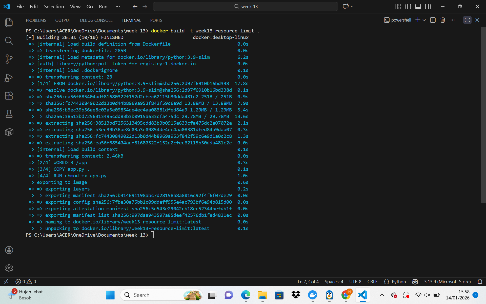
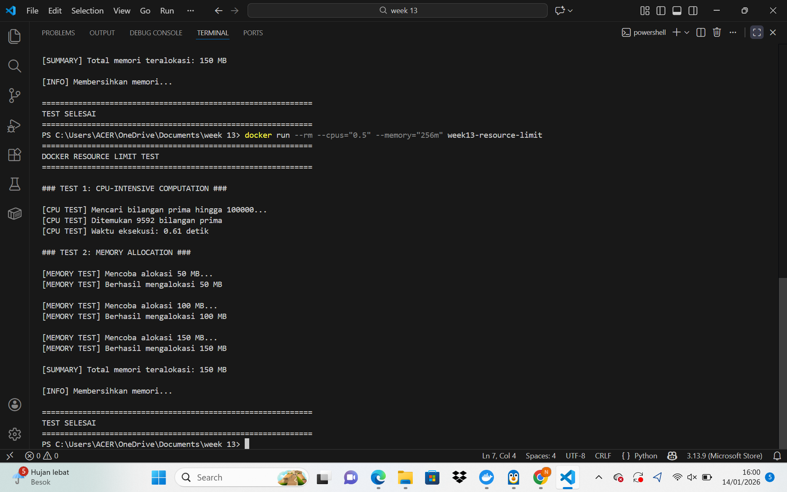
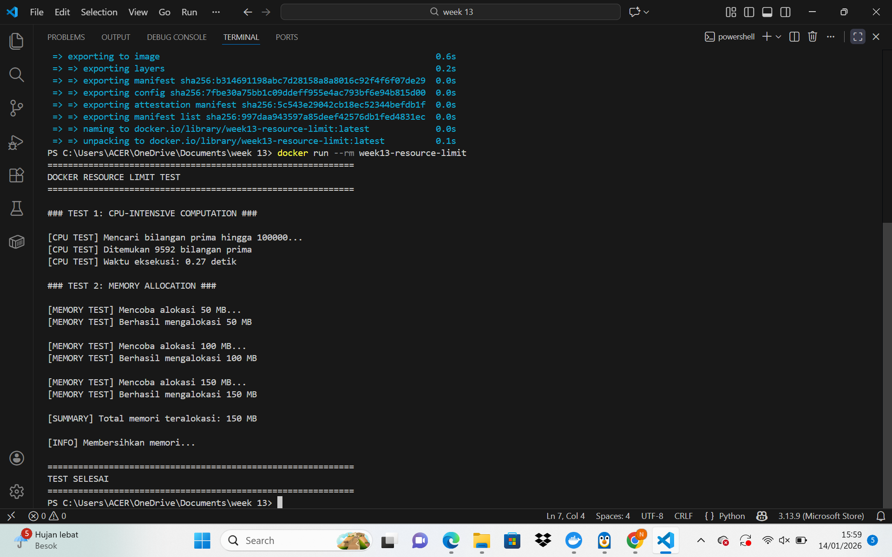
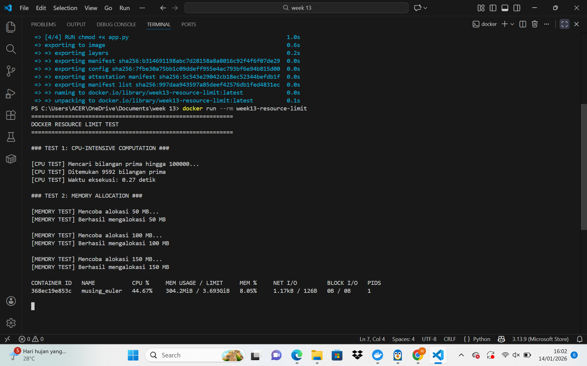

# Laporan Praktikum Minggu [13]
Topik: [Docker – Resource Limit (CPU & Memori)]

---

## Identitas
- **Nama**  : [Nisa'ul Hidayah]  
- **NIM**   : [250202981]  
- **Kelas** : [1IKRB]

---

## Tujuan
1. Menulis Dockerfile sederhana untuk sebuah aplikasi/skrip.
2. Membangun image dan menjalankan container.
3. Menjalankan container dengan pembatasan **CPU** dan **memori**.
4. Mengamati dan menjelaskan perbedaan eksekusi container dengan dan tanpa limit resource.
5. Menyusun laporan praktikum secara runtut dan sistematis.

---

## Dasar Teori
- Containerization dan Docker

Containerization adalah teknologi untuk mengemas aplikasi beserta semua dependensinya (library, file konfigurasi, dll) ke dalam satu paket yang disebut container. Container bersifat portable, artinya bisa jalan di mana saja (laptop, server, cloud) dengan hasil yang sama. Docker adalah platform paling populer untuk membuat dan menjalankan container.
- Control Groups (cgroups)

Cgroups adalah fitur di Linux yang berfungsi membatasi berapa banyak resource (CPU, RAM, dll) yang boleh dipakai oleh sekelompok proses. Docker pakai cgroups ini untuk membatasi resource container. 
- Resource Limits di Docker dan OOM (Out of Memory) Killer

Docker punya perintah untuk membatasi resource container, contohnya --cpus="0.5" (cuma boleh pakai setengah core CPU) atau --memory="256m" (maksimal 256MB RAM). Batasan ini dipaksa berlaku oleh sistem operasi, jadi container tidak bisa "curang". Ketika container mencoba menggunakan memori melebihi limit yang ditetapkan, Linux OOM Killer dapat mengintervensi dan menghentikan proses di dalam container untuk melindungi stabilitas sistem.

---

## Langkah Praktikum
1. **Persiapan Lingkungan**

   - Pastikan Docker terpasang dan berjalan.
   - Verifikasi:
     ```bash
     docker version
     docker ps
     ```

2. **Membuat Aplikasi/Skrip Uji**

   Buat program sederhana di folder `code/` (bahasa bebas) yang:
   - Melakukan komputasi berulang (untuk mengamati limit CPU), dan/atau
   - Mengalokasikan memori bertahap (untuk mengamati limit memori).

3. **Membuat Dockerfile**

   - Tulis `Dockerfile` untuk menjalankan program uji.
   - Build image:
     ```bash
     docker build -t week13-resource-limit .
     ```

4. **Menjalankan Container Tanpa Limit**

   - Jalankan container normal:
     ```bash
     docker run --rm week13-resource-limit
     ```
   - Catat output/hasil pengamatan.

5. **Menjalankan Container Dengan Limit Resource**

   Jalankan container dengan batasan resource (contoh):
   ```bash
   docker run --rm --cpus="0.5" --memory="256m" week13-resource-limit
   ```
   Catat perubahan perilaku program (mis. lebih lambat, error saat memori tidak cukup, dll.).

6. **Monitoring Sederhana**

   - Jalankan container (tanpa `--rm` jika perlu) dan amati penggunaan resource:
     ```bash
     docker stats
     ```
   - Ambil screenshot output eksekusi dan/atau `docker stats`.

7. **Commit & Push**

   ```bash
   git add .
   git commit -m "Minggu 13 - Docker Resource Limit"
   git push origin main
   ```

---

## Kode / Perintah
Tuliskan potongan kode atau perintah utama:
   ```bash
      docker build -t week13-resource-limit .
   ```
   ```bash
     docker run --rm week13-resource-limit
   ```
   ```bash
      docker run --rm --cpus="0.5" --memory="256m" week13-resource-limit
   ```
   ```bash
     docker stats
   ```
---

## Hasil Eksekusi
1. Membuat Dockerfile

2. Menjalankan Container Tanpa Limit

3. Menjalankan Container Dengan Limit Resource

4. Monitoring Sederhana



---

## Analisis
- Pengujian menunjukkan bahwa pembatasan resource pada container Docker berpengaruh langsung terhadap kinerja aplikasi. Pada pengujian tanpa limit, container dapat menggunakan CPU host secara lebih bebas sehingga waktu eksekusi komputasi (pencarian bilangan prima) lebih cepat. Ketika diterapkan limit CPU (--cpus="0.5"), waktu eksekusi meningkat karena container hanya mendapat sebagian jatah prosesor, sesuai dengan mekanisme pengaturan cgroups. Pada pengujian memori, alokasi memori bertahap (50 MB, 100 MB, 150 MB) berhasil, namun tetap berada dalam batas memori yang ditentukan. Hal ini menunjukkan bahwa limit memori berfungsi sebagai pengaman agar container tidak menggunakan RAM secara berlebihan. Monitoring menggunakan docker stats memperlihatkan penggunaan CPU dan memori container menjadi lebih stabil dan terkontrol saat limit diterapkan. Secara keseluruhan, praktikum ini membuktikan bahwa Docker mampu mengelola dan membatasi resource secara efektif sehingga mendukung efisiensi dan stabilitas sistem.

---

## Kesimpulan
1. Docker menyediakan mekanisme pembatasan resource CPU dan memori yang efektif melalui fitur cgroups, sehingga penggunaan resource oleh container dapat dikendalikan dengan baik.
2. Penerapan limit CPU berpengaruh nyata terhadap performa aplikasi, di mana proses komputasi berjalan lebih lambat dibandingkan tanpa limit karena jatah waktu prosesor dibatasi.
3. Penerapan limit memori berfungsi sebagai pengaman sistem dengan mencegah aplikasi di dalam container menggunakan RAM secara berlebihan yang dapat mengganggu kestabilan host.

---

## Quiz
1. [Mengapa container perlu dibatasi CPU dan memori?]
   
   **Jawaban:**  
   Pembatasan CPU dan memori pada container sangat penting untuk memastikan stabilitas dan keadilan sumber daya dalam lingkungan multi-penyewa (multi-tenant). Tanpa batasan, sebuah container tunggal dapat mengonsumsi semua sumber daya host yang tersedia, menyebabkan kelambatan atau bahkan crash pada container lain dan seluruh sistem host.
2. [Apa perbedaan VM dan container dalam konteks isolasi resource?]  
   **Jawaban:**  
   VM (Virtual Machine): Isolasi melalui virtualisasi perangkat keras penuh. Setiap VM berjalan di atas hypervisor dan memiliki kernel sistem operasi tamu (guest OS) sendiri, yang mengelola sumber daya virtual secara independen. 
   Container: Isolasi lebih ringan di level sistem operasi menggunakan fitur kernel (cgroups), karena berbagi kernel yang sama dengan host.

3. [Apa dampak limit memori terhadap aplikasi yang boros memori?]  
   **Jawaban:**  
   Dampak dari limit memori menyebabkan aplikasi yang boros memori tidak dapat menggunakan RAM melebihi batas yang ditentukan. Jika aplikasi melampaui batas tersebut, performanya dapat menurun atau bahkan dihentikan oleh sistem, sehingga mencegah gangguan pada host.

---

## Refleksi Diri
Tuliskan secara singkat:
- Apa bagian yang paling menantang minggu ini?  
- Bagaimana cara Anda mengatasinya?  

---

**Credit:**  
_Template laporan praktikum Sistem Operasi (SO-202501) – Universitas Putra Bangsa_
