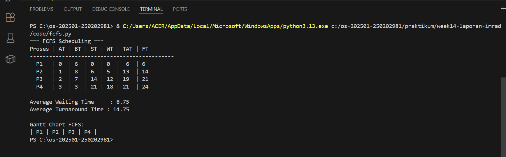
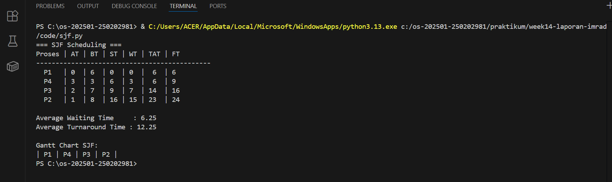

# Laporan Praktikum Minggu [14]
Topik: [ Penyusunan Laporan Praktikum Format IMRAD]

---

## Identitas
- **Nama**  : [Nisa'ul Hidayah]  
- **NIM**   : [250202981]  
- **Kelas** : [1IKRB]

---

## Pendahuluan
## Latar Belakang
Penjadwalan CPU merupakan salah satu fungsi utama sistem operasi yang bertujuan untuk mengatur urutan eksekusi proses agar penggunaan prosesor menjadi efisien dan adil. Setiap proses memiliki waktu kedatangan (arrival time) dan waktu eksekusi (burst time) yang harus dikelola oleh sistem operasi agar tidak etrjadi penumpukan proses. Terdapat dua algoritma penjadwalan yang paling dasar adalah First Come First Served (FCFS) dan Shortest Job First (SJF). FCFS mengeksekusi proses berdasarkan urutan kedatangan, sedangkan SJF memprioritaskan proses dengan waktu eksekusi paling pendek.

Pemahaman terhadap kedua algoritma ini penting dalam konteks praktikum sistem operasi karena membantu mahasiswa memahami konsekuensi pilihan algoritma terhadap kinerja sistem antara kesederhanaan implementasi dan performa sistem. Dengan melakukan simulasi langsung terhadap FCFS dan SJF, mahasiswa dapat membandingkan hasil empiris dengan teori dan menilai algoritma mana yang lebih sesuai untuk kondisi sistem tertentu (Indra et al., 2023).

## Rumusan Masalah
Bagaimana perbandingan performa antara algoritma FCFS dan SJF dalam hal rata-rata waktu tunggu (Average Waiting Time) dan rata-rata waktu penyelesaian (Average Turnaround Time)?

## Tujuan
Praktikum ini bertujuan untuk:
1. Mengimplementasikan dan menganalisis algoritma penjadwalan FCFS dan SJF
2. Menghitung dan membandingkan nilai Average Waiting Time dan Average Turnaround Time pada kedua algoritma
3. Mengidentifikasi kondisi optimal penggunaan masing-masing algoritma


---

## Metode
### Lingkungan Uji
Simulasi algoritma FCFS dan SJF diimplementasikan menggunakan bahasa pemrograman Python.
### Dataset uji
Tabel proses yang digunakan:

| Proses | Burst Time | Arrival Time |
|:--:|:--:|:--:|
| P1 | 6 | 0 |
| P2 | 8 | 1 |
| P3 | 7 | 2 |
| P4 | 3 | 3 |
**Tabel 1.** Dataset proses untuk pengujian algoritma FCFS dan SJF
### Parameter Pengukuran

Dua metrik utama yang diukur adalah:

1. **Waiting Time (WT)**: Waktu yang dihabiskan proses menunggu di ready queue sebelum mendapat giliran eksekusi
   ```
   WT = Waktu Mulai Eksekusi - Arrival Time
   ```

2. **Turnaround Time (TAT)**: Total waktu dari proses tiba hingga selesai dieksekusi
   ```
   TAT = WT + Burst Time
   ```
### Langkah Eksperimen
#### Eksperimen 1: Algoritma FCFS
1. Proses diurutkan berdasarkan arrival time.
2. Proses dieksekusi secara berurutan tanpa preemption.
3. Start time setiap proses dihitung dari waktu selesai proses sebelumnya.
4. Nilai waiting time dan turnaround time dihitung untuk setiap proses.
5. Rata-rata WT dan TAT dihitung sebagai indikator performa.
#### Eksperimen 2: Algoritma SJF 
1. Proses dipilih berdasarkan burst time terpendek yang telah tiba.
2. Proses dengan durasi terpendek diprioritaskan untuk dieksekusi.
3. Perhitungan WT dan TAT dilakukan dengan metode yang sama seperti FCFS.
4. Hasil dibandingkan dengan FCFS untuk analisis performa.

---

## Hasil Eksekusi
### A. Hasil FCFS

Gantt chart
```
     | P1 | P2 | P3 | P4 |
     0    6    14   21   24
```
### B. Hasil SJF

Gantt chart
```
     | P1 | P2 | P3 | P4 |
     0    6    9   16   24
```
### C. Perbandingan FCFS dan SJF
| Algoritma | Avg Waiting Time | Avg Turnaround Time | Kelebihan | Kekurangan |
|------------|------------------|----------------------|------------|-------------|
| FCFS | 8,75 | 14,75 | Sederhana dan mudah diterapkan | Tidak efisien untuk proses panjang |
| SJF | 6,25 | 12,25 | Optimal untuk job pendek | Menyebabkan *starvation* pada job panjang |

---

## Pembahasan
Hasil praktikum menunjukkan bahwa algoritma SJF menghasilkan rata-rata waiting time dan turnaround time lebih rendah dibandingkan FCFS, sejalan dengan hasil penelitian yang menyatakan bahwa SJF secara teoritis meminimalkan total waktu tunggu dengan memprioritaskan proses berdurasi pendek (Indra et al., 2023). Sebaliknya, FCFS cenderung mengalami convoy effect, yaitu kondisi ketika proses panjang di awal antrian menyebabkan proses lain menunggu lebih lama.
Meskipun demikian, keunggulan SJF tidak selalu berlaku pada semua sistem karena membutuhkan estimasi burst time yang akurat serta berisiko menyebabkan starvation jika proses pendek terus berdatangan. Oleh karena itu, pemilihan algoritma penjadwalan harus mempertimbangkan kebutuhan sistem, apakah lebih mengutamakan efisiensi waktu atau keadilan dalam pembagian sumber daya (Al Ghifari & Siregar, 2022). 

---

## Kesimpulan
1. Algoritma SJF (Shortest Job First) menghasilkan rata-rata waiting time dan turnaround time yang lebih rendah dibandingkan FCFS (First Come First Served), sehingga lebih efisien dalam penggunaan CPU.
2. Algoritma FCFS mudah diterapkan dan adil berdasarkan urutan kedatangan proses, namun kurang optimal ketika terdapat proses dengan waktu eksekusi yang panjang.
3. Pemilihan algoritma penjadwalan harus disesuaikan dengan karakteristik sistem, karena terdapat kompromi antara efisiensi waktu eksekusi dan keadilan dalam pembagian sumber daya.

---

## Quiz
1. [Mengapa format IMRAD membantu membuat laporan praktikum lebih ilmiah dan mudah dievaluasi?]  
   **Jawaban:**  
   Karena IMRAD menyusun laporan dengan sistematis yang terdiri dari pendahuluan yang memberikan konteks dan tujuan, metode memungkinkan replikasi ilmiah, hasill memyajikan data yang objektif, dan pembahasan menginterpertasikan temuan. Struktur ini memudahkan pembaca memahami alur penelitian. 
2. [Apa perbedaan antara bagian **Hasil** dan **Pembahasan**?]  
   **Jawaban:**  
   Hasil hanya menyajikan data dan temuan, sedangkan pembahasan menginterpretasikan dan analisis dari hasil tersebut.
3. [Mengapa sitasi dan daftar pustaka penting, bahkan untuk laporan praktikum?]  
   **Jawaban:** 
   Karena sitasi menunjukan bahwa anilisis didukung teori ilmiah dan mencegah plagiarisme. 

---

## Daftar Pustaka
Al Ghifari, A., & Siregar, H. (2022). Analisis perbandingan algoritma penjadwalan CPU FCFS dan SJF. JUPIN (Jurnal Penelitian Inovatif), 3(1), 88–95. https://www.jurnal-id.com/index.php/jupin/article/view/1957

Indra, Z., Zidan, A. A., Silaen, A. A., Habibi, A. N., & Sitepu, K. P. (2023). Analisis algoritma penjadwalan CPU pada sistem operasi. REMIK (Jurnal Riset dan E-Jurnal Manajemen Informatika Komputer), 7(2), 45–52. https://jurnal.polgan.ac.id/index.php/remik/article/view/14924

---

## Refleksi Diri
Tuliskan secara singkat:
- Apa bagian yang paling menantang minggu ini?  
- Bagaimana cara Anda mengatasinya?  

---

**Credit:**  
_Template laporan praktikum Sistem Operasi (SO-202501) – Universitas Putra Bangsa_
