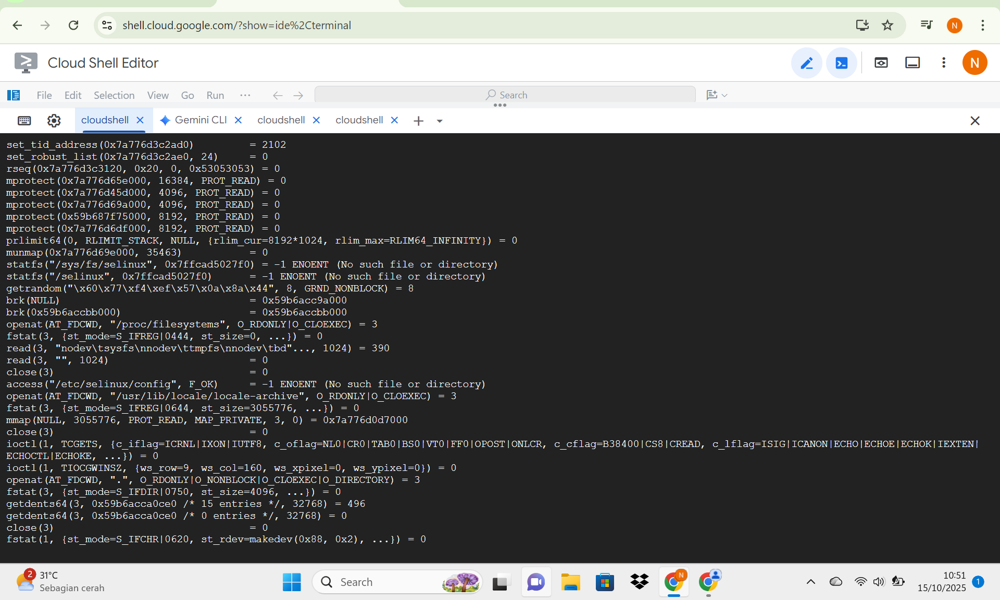
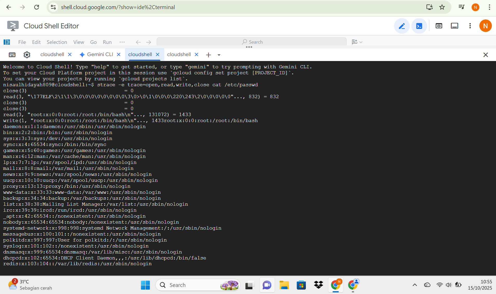
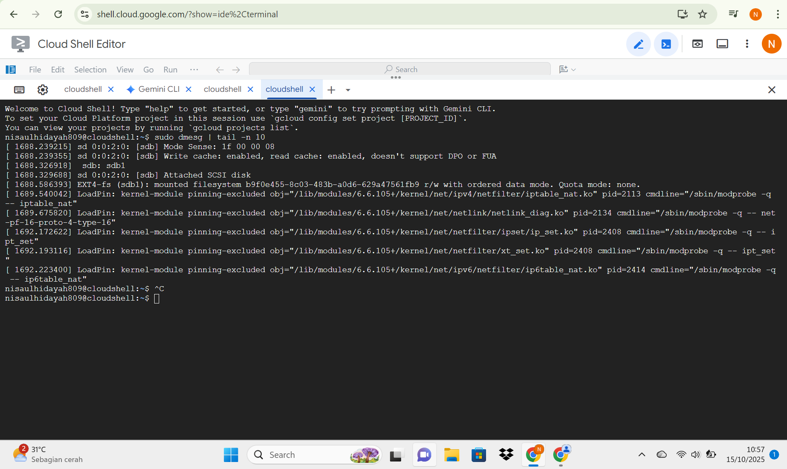
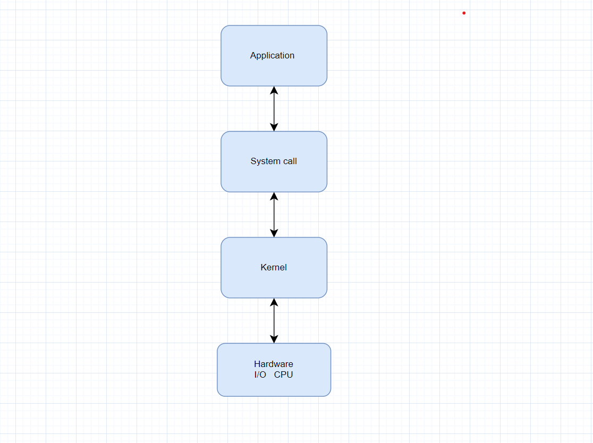

# Laporan Praktikum Minggu [2]
Topik: [Struktur System Call dan Fungsi Kernel]

---

## Identitas
- **Nama**  : [Nisa'ul hidayah]  
- **NIM**   : [250202981]  
- **Kelas** : [1IKRB]

---

## Tujuan 
> Menjelaskan konsep dan fungsi system call dalam sistem operasi.
> Mengidentifikasi jenis-jenis system call dan fungsinya.
> Mengamati alur perpindahan mode user ke kernel saat system call terjadi.
> Menggunakan perintah Linux untuk menampilkan dan menganalisis system call.

---

## Dasar Teori
1. System call adalah antarmuka antara program aplikasi dan kernel yang memungkinkan aplikasi berinteraksi dengan perangkat keras secara aman melalui layanan OS.
2. Kernel berperan sebagai pengendali utama yang memproses setiap system call agar berjalan aman.Fungsi kernel sendiri yaitu manajemen proses dan penjadwalan,pengelolaan sumber daya agar tidak terjadi konflik antar proses.
3. Hubungan system call dan kernel.System call berperan sebagai penghubung yang aman menuju kernel.Semua interaksi antaraaplikasi dan perangkat keras harus melalui kernel,sehinga sistem operasi dapat mengontrol,memantau dan menjaga kestabilan serta keamanan sistem.

---

## Langkah Praktikum
1. Setup Environment
Gunakan Linux (Ubuntu/WSL).
Pastikan perintah strace dan man sudah terinstal.
Konfigurasikan Git (jika belum dilakukan di minggu sebelumnya).
2. Eksperimen 1 – Analisis System Call Jalankan perintah berikut:
strace ls
3. Eksperimen 2 – Menelusuri System Call File I/O Jalankan:
strace -e trace=open,read,write,close cat /etc/passwd
4. Eksperimen 3 – Mode User vs Kernel Jalankan:
dmesg | tail -n 10
5. Diagram Alur System Call
Buat diagram yang menggambarkan alur eksekusi system call dari program user hingga kernel dan kembali lagi ke user mode.
Gunakan draw.io / mermaid.
Simpan di:
praktikum/week2-syscall-structure/screenshots/syscall-diagram.png
6. Commit & Push

---

## Kode / Perintah
Tuliskan potongan kode atau perintah utama:
```bash
strace ls
strace -e trace=open,read,write,close cat /etc/passwd
dmesg | tail -n 10
```

---

## Hasil Eksekusi
Sertakan screenshot hasil percobaan atau diagram:




---

## Analisis
> Eksperimen 1

| No | System Call | Contoh Pemanggilan | Fungsi / Penjelasan |
|----|--------------|--------------------|----------------------|
| 1  | **execve()** | `execve("/usr/bin/ls", ["ls"], 0x7ffcef9c03d0)` | Menjalankan program baru (`ls`) dan menggantikan proses saat ini dengan program tersebut. Ini adalah pemanggilan utama yang memulai eksekusi `ls`. |
| 2  | **brk()** | `brk(NULL)` | Mengatur atau mendapatkan batas akhir dari heap proses (memori dinamis). Digunakan untuk manajemen memori. |
| 3  | **access()** | `access("/etc/ld.so.preload", R_OK)` | Mengecek apakah file dapat diakses atau ada (di sini file `/etc/ld.so.preload` tidak ditemukan). |
| 4  | **openat()** | `openat(AT_FDCWD, "/etc/ld.so.cache", O_RDONLY|O_CLOEXEC)` | Membuka file atau direktori yang dibutuhkan program `ls` agar dapat membaca library dan menampilkan isi direktori. |
| 5  | **mmap()** | `mmap(NULL, 35463, PROT_READ, MAP_PRIVATE, 3, 0)` | Memetakan isi file (`ld.so.cache`) ke dalam memori agar dapat diakses lebih cepat. |
| 6  | **read()** | `read(3, "\177ELF\2\1\1\0...", 832)` | Membaca isi awal file (biasanya header ELF untuk verifikasi format binary library). |
| 7  | **close()** | `close(3)` | Menutup file descriptor (nomor 3) setelah selesai digunakan. |
[text](results/syscall_ls.txt)

> Eksperimen 2

| No | System Call | Proses yang Terjadi | Analisis Kernel |
|----|--------------|--------------------|------------------|
| 1  | **open()** | File `/etc/passwd` dibuka oleh perintah `cat`. | Kernel menerima permintaan untuk membuka file sistem `/etc/passwd` dan memberikan file descriptor (misalnya nomor 3) agar bisa diakses oleh proses. |
| 2  | **read()** | `read(3, "root:x:0:0:root:/root:/bin/bash\n"..., 131072)` | Kernel membaca isi file berdasarkan file descriptor 3 dan memindahkan datanya ke buffer pengguna. |
| 3  | **write()** | `write(1, "root:x:0:0:root:/root:/bin/bash\n"..., 1433)` | Kernel menyalin data dari buffer pengguna ke perangkat output standar (stdout) dengan file descriptor 1. |
| 4  | **read() (EOF)** | `read(3, "", 131072) = 0` | Kernel mendeteksi bahwa tidak ada lagi data yang bisa dibaca dari file. Nilai 0 menandakan *end of file* (EOF). |
| 5  | **close()** | `close(3) = 0` | Kernel menutup file descriptor 3, membebaskan sumber daya yang digunakan untuk file `/etc/passwd`. |
| 6  | **close(1)** | `close(1) = 0` | Kernel menutup saluran output standar (stdout). |
| 7  | **close(2)** | `close(2) = 0` | Kernel menutup saluran error standar (stderr). |
| 8  | **exit()** | `+++ exited with 0 +++` | Kernel mengakhiri eksekusi program `cat` dengan kode keluar 0 (berhasil tanpa error). |

> Eksperimen 3

| No | Aspek Perbandingan | Log Kernel (`dmesg`) | Output Program Biasa |
|----|---------------------|----------------------|----------------------|
| 1 | **Sumber Pesan** | Dikeluarkan langsung oleh **kernel** (inti OS) untuk mencatat aktivitas perangkat keras dan driver sistem. | Dihasilkan oleh **program pengguna** (user-space), seperti perintah `ls`, `cat`, atau `echo`. |
| 2 | **Isi Informasi** | Memuat pesan sistem tingkat rendah seperti **deteksi perangkat, proses mounting, modul kernel, serta error hardware**. | Menampilkan hasil eksekusi dari program, seperti **daftar file, teks, atau data keluaran**. |
| 3 | **Akses Level** | Bekerja di **kernel space**, menampilkan aktivitas internal sistem operasi. | Berjalan di **user space**, hanya memperlihatkan hasil interaksi pengguna dengan sistem. |
| 4 | **Tujuan Utama** | Digunakan untuk **pemantauan sistem**, analisis kernel, dan melihat aktivitas modul atau perangkat keras. | Digunakan untuk **menampilkan hasil kerja program**, sehingga bisa dibaca langsung oleh pengguna. |
| 5 | **Contoh Output** | `[1688.586393] EXT4-fs (sdb1): mounted filesystem ...` menandakan kernel mengenali dan memasang disk baru. | `root:x:0:0:root:/root:/bin/bash` dari perintah `cat /etc/passwd`, menunjukkan isi file teks. |

---

## Kesimpulan
1. System call berfungsi sebagai penghubung antara program pengguna dan kernel untuk menjalankan operasi sistem secara aman dan terkontrol.
2. Perintah strace membantu memahami bagaimana aplikasi berinteraksi dengan kernel melalui system call, sedangkan dmesg menampilkan log aktivitas kernel dan perangkat keras.

---

## Tugas
1. Tabel observasi

| No | Perintah | Output | Penjelasan / Keterangan |
|----|-----------|--------|-------------------------|
| 1 | **`strace ls`** | Menampilkan deretan system call seperti `execve()`, `openat()`, `read()`, `write()`, dan `close()`. | Perintah `strace ls` digunakan untuk memantau interaksi antara program `ls` dan kernel. Setiap system call menunjukkan tahapan program membaca direktori, membuka file library, menulis hasil ke terminal, lalu menutup file. |
| 2 | **`strace -e trace=open,read,write,close cat /etc/passwd`** | Menampilkan aktivitas pembukaan (`open`), pembacaan (`read`), penulisan (`write`), dan penutupan (`close`) file `/etc/passwd`. | Perintah ini memfokuskan pelacakan hanya pada system call tertentu. Dari hasilnya terlihat bagaimana `cat` membuka file `/etc/passwd`, membaca isinya, menulis ke layar (stdout), lalu menutup file descriptor. |
| 3 | **`dmesg`** | Menampilkan log kernel seperti deteksi disk baru, modul kernel dimuat, dan proses mounting filesystem. | `dmesg` menunjukkan pesan dari kernel terkait aktivitas sistem dan perangkat keras. Berbeda dengan `strace`, `dmesg` beroperasi di level kernel space, bukan program user. |
2. Diagram alur system call

3. Analisis 400-500 kata
 1. [Mengapa system call penting untuk keamanan os?]
 System call merupakan bagian penting dalam sistem operasi karena berperan sebagai penghubung yang aman antara user space (ruang pengguna) dan kernel space (ruang inti sistem). Dalam sistem operasi modern, kernel memiliki hak akses tertinggi untuk mengatur semua sumber daya perangkat keras seperti CPU, memori, dan perangkat input/output. Jika program pengguna bisa langsung mengakses perangkat keras tanpa pengawasan, hal ini bisa menimbulkan masalah serius, seperti kebocoran data, kerusakan sistem, atau gangguan pada perangkat.Dengan adanya system call, setiap permintaan dari program pengguna akan diperiksa terlebih dahulu oleh kernel. Kernel akan menilai apakah pengguna memiliki izin  yang cukup (hak akses), memeriksa parameter yang dikirim, dan memastikan sumber daya yang diminta memang boleh digunakan. Hanya permintaan yang valid dan aman yang akan diproses. Sebagai contoh, ketika sebuah program ingin membuka file sistem, kernel akan mengecek apakah pengguna memiliki hak akses yang benar. Jika tidak, kernel akan menolak permintaan tersebut dan memberikan pesan kesalahan. Hal ini membuktikan bahwa system call bukan hanya alat komunikasi antara program dan kernel, tetapi juga berfungsi sebagai pelindung sistem agar tetap aman dan stabil. 
 2. [Bagaimana os memastikan transisi user-kernel berjalan aman]
Perpindahan dari user mode ke kernel mode merupakan proses yang sangat penting karena menyangkut perubahan tingkat akses dari pengguna biasa ke sistem inti. Untuk menjaga keamanannya, sistem operasi menggunakan mekanisme seperti interrupt atau software tap.Cara ini memastikan bahwa tidak ada program yang bisa langsung masuk ke area kernel tanpa izin dari sistem. Hanya perintah tertentu yang diperbolehkan untuk memicu perpindahan ke mode kernel.Selain itu, sistem operasi juga menerapkan perlindungan memori (memory protection) agar area memori milik kernel tidak bisa diakses oleh program pengguna. Jika ada program yang mencoba membaca atau menulis ke area tersebut, sistem akan menolak akses dan menampilkan kesalahan. Setiap system call juga memiliki nomor khusus (system call number) yang tersimpan dalam tabel system call. Saat pengguna menjalankan perintah, kernel akan mencocokkan nomor tersebut dengan fungsi yang sesuai di tabel. Jika terjadi kesalahan atau permintaan yang tidak sah, kernel akan mengirimkan pesan error tanpa membuat sistem macet atau rusak. Dengan mekanisme ini, sistem operasi dapat tetap berjalan dengan aman dan stabil meskipun terjadi kesalahan pada program pengguna. 
 3. [Sebutkan contoh system call yang sering digunakan di linux]
Dalam sistem operasi Linux, terdapat berbagai system call yang umum digunakan untuk menjalankan fungsi dasar. Beberapa di antaranya adalah:
read() dan write() untuk membaca dan menulis data pada file atau perangkat.
open() dan close() untuk membuka serta menutup file.
fork() dan exec() untuk membuat serta mengeksekusi proses baru.
wait() untuk menunggu proses anak selesai.
exit() untuk mengakhiri proses.

---

## Quiz
1. [Apa fungsi utama system call dalam sistem operasi?]  
   **Sebagai penghubung antar program user dan kernel sistem operasi dan memungkinkan program untuk meminta layanan seperti mengakses file,manajemen proses dan interaksi dengan perangkat keras.**  
2. [Sebutkan 4 kategori system call yang umum digunakan.]  
   **Manajemen file, manajemen perangkat, manajemen proses, dan komunikasi antar proses**  
3. [Mengapa system call tidak bisa dipanggil langsung oleh user program?]  
   **System call tidak bisa dipanggil langsung karena harus melewati mekanisme keamanan sistem operasi agar interaksi antara user program dan kernel berjalan dengan aman**  

---

## Refleksi Diri
Tuliskan secara singkat:
- Memahami cara kerja system call dan saat menjalankan perintah strace dan dmesg, banyak output system call yang muncul sehingga sulit untuk memahami fungsi secara detail.
- Mempelajari system call lebih dalam lagi.  

---

**Credit:**  
_Template laporan praktikum Sistem Operasi (SO-202501) – Universitas Putra Bangsa_
