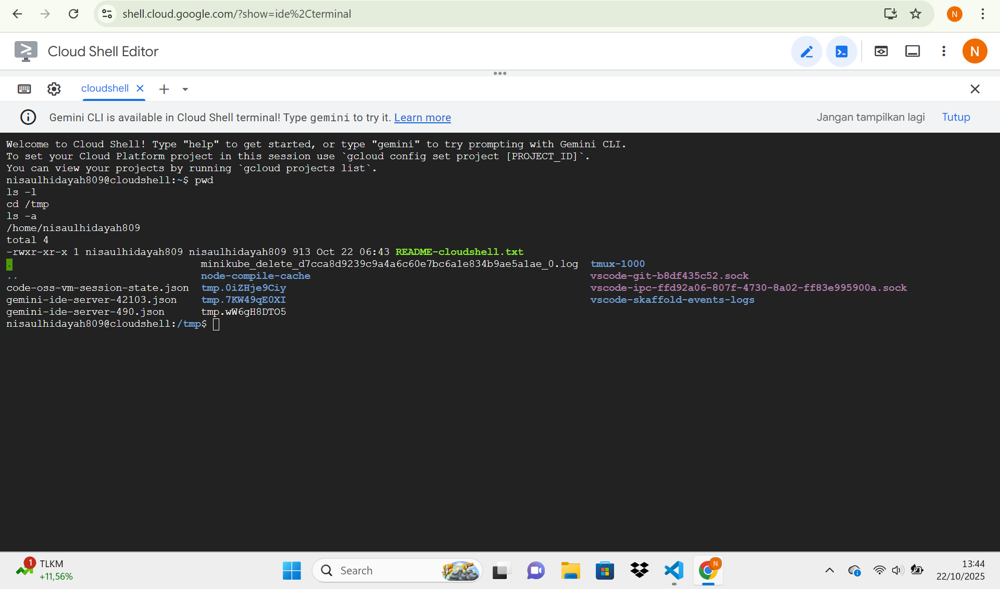
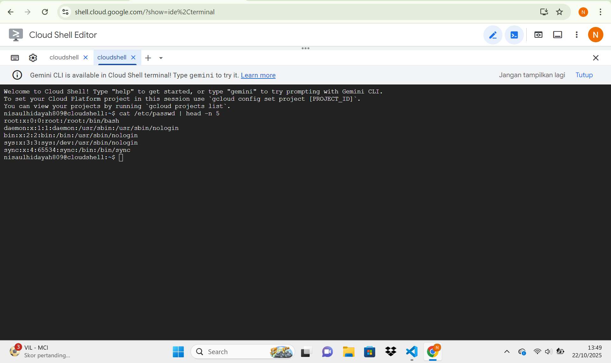
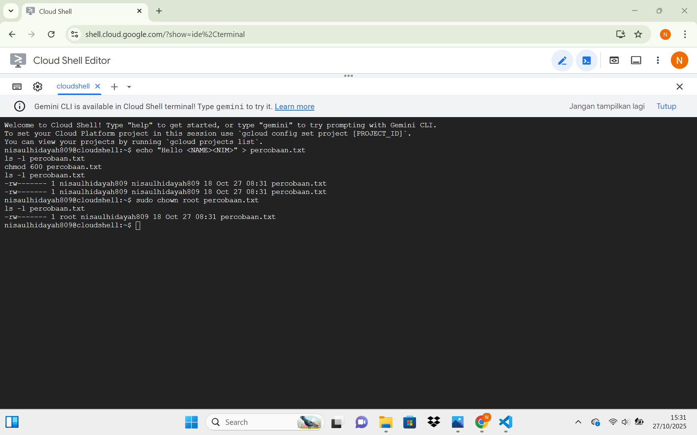

# Laporan Praktikum Minggu [3]
Topik: [Manajemen File dan Permission di Linux]

---

## Identitas
- **Nama**  : [Nisa'ul hidayah]  
- **NIM**   : [250202981]  
- **Kelas** : [1IKRB]

---

## Tujuan
> Menggunakan perintah `ls`, `pwd`, `cd`, `cat` untuk navigasi file dan direktori.
> Menggunakan `chmod` dan `chown` untuk manajemen hak akses file.
> Menjelaskan hasil output dari perintah Linux dasar.
> Menyusun laporan praktikum dengan struktur yang benar.
> Mengunggah dokumentasi hasil ke Git Repository tepat waktu.

---

## Dasar Teori
1. Sistem operasi linux yang menggunakan struktur direktori hierarkis yang dimulai dari direktori root (/) yang dimana semuanya diperlukan sebagai file, termasuk direktori, perangkat keras, tautan.Setiap file dan folder diatur berdasarkan fungsi dan kepemilikan, serta dapat diakses menggunakan perintah ls,cd,pwd,cp,mv,dan rm.Sistem ini
menggunakan izin file untuk mengatur akses (baca, tulis, eksekusi) untuk pemilik, grup, dan pengguna lain.
2. Setiap file di linux memiliki tiga jenis hak akses utama, yaitu read (r) izin untuk membaca isi file atau menampilkan daftar direktori,write (w) izin untuk mengubah atau menghapus file,dan yang terakhir execute (x) izin untuk menjalankan file sebagai program.Hak akses tersebut diberikan untuk tiga kategori pengguna yaitu owner (pemilik), group (kelompok), dan others (lainnya). 

---

## Langkah Praktikum
1. **Setup Environment**
   - Gunakan Linux (Ubuntu/WSL).
   - Pastikan folder kerja berada di dalam direktori repositori Git praktikum:
     ```
     praktikum/week3-linux-fs-permission/
     ```

2. **Eksperimen 1 – Navigasi Sistem File**
   Jalankan perintah berikut:
   ```bash
   pwd
   ls -l
   cd /tmp
   ls -a
   ```
   - Jelaskan hasil tiap perintah.
   - Catat direktori aktif, isi folder, dan file tersembunyi (jika ada).

3. **Eksperimen 2 – Membaca File**
   Jalankan perintah:
   ```bash
   cat /etc/passwd | head -n 5
   ```
   - Jelaskan isi file dan struktur barisnya (user, UID, GID, home, shell).

4. **Eksperimen 3 – Permission & Ownership**
   Buat file baru:
   ```bash
   echo "Hello <NAME><NIM>" > percobaan.txt
   ls -l percobaan.txt
   chmod 600 percobaan.txt
   ls -l percobaan.txt
   ```
   - Analisis perbedaan sebelum dan sesudah chmod.  
   - Ubah pemilik file (jika memiliki izin sudo):
   ```bash
   sudo chown root percobaan.txt
   ls -l percobaan.txt
   ```
   - Catat hasilnya.

5. **Eksperimen 4 – Dokumentasi**
   - Ambil screenshot hasil terminal dan simpan di:
     ```
     praktikum/week3-linux-fs-permission/screenshots/
     ```
   - Tambahkan analisis hasil pada `laporan.md`.

6. **Commit & Push**
   ```bash
   git add .
   git commit -m "Minggu 3 - Linux File System & Permission"
   git push origin main
   ```
---

## Kode / Perintah
Tuliskan potongan kode atau perintah utama:
```bash
   pwd
   ls -l
   cd /tmp
   ls -a
```
```bash
   cat /etc/passwd | head -n 5
```
```bash
   echo "Hello <NAME><NIM>" > percobaan.txt
   ls -l percobaan.txt
   chmod 600 percobaan.txt
   ls -l percobaan.txt
```
---

## Hasil Eksekusi
Sertakan screenshot hasil percobaan atau diagram:




---

## Analisis
- Eksperimen 1

| **Perintah** | **Output / Hasil** | **Keterangan** |
|---------------|--------------------|-----------------|
| `pwd` | `/home/nisaulhidayah809` | Saat perintah ini dijalankan, user berada di direktori `/home/nisaulhidayah809`. |
| `ls -a` | `.  ..  README-cloudshell.txt  code-oss-vm-session-state.json  gemini-ide-server-42103.json  gemini-ide-server-490.json  minikube_delete_d7cca8d9239c9a4a6c60e7bc6a1e834b9ae5alae_0.log  node-compile-cache  tmp.0ZiHje9Ciy  tmp.7KW49g8OXI  tmp.WW6gHBDT05  tmux-1000  vscode-git-b8df435c52.sock  vscode-ipc-ff492a06-807f-4730-8a02-ff83e995900a.sock  vscode-skaffold-events-logs` | Menampilkan seluruh isi folder, termasuk file tersembunyi (yang diawali tanda titik `.`). |

| **No** | **Nama File / Folder** | **Jenis** | **Keterangan** |
|---------|------------------------|-----------|----------------|
| 1 | README-cloudshell.txt | File teks | File informasi Cloud Shell |
| 2 | code-oss-vm-session-state.json | File JSON | Menyimpan status sesi editor |
| 3 | gemini-ide-server-42103.json | File JSON | Konfigurasi server Gemini IDE |
| 4 | gemini-ide-server-490.json | File JSON | Konfigurasi server Gemini IDE |
| 5 | minikube_delete_d7cca8d9239c9a4a6c60e7bc6a1e834b9ae5alae_0.log | File log | Log proses minikube |
| 6 | node-compile-cache | Folder | Cache hasil kompilasi Node.js |
| 7 | tmp.0ZiHje9Ciy | Folder | Folder sementara |
| 8 | tmp.7KW49g8OXI | Folder | Folder sementara |
| 9 | tmp.WW6gHBDT05 | Folder | Folder sementara |
| 10 | tmux-1000 | Folder | Folder konfigurasi Tmux |
| 11 | vscode-git-b8df435c52.sock | Socket file | Koneksi Git di VS Code |
| 12 | vscode-ipc-ff492a06-807f-4730-8a02-ff83e995900a.sock | Socket file | Koneksi IPC VS Code |
| 13 | vscode-skaffold-events-logs | File log | Log aktivitas Skaffold |
- Eksperimen 2

| **Username** | **UID** | **GID** | **Home Directory** | **Shell** | **Keterangan** |
|---------------|----------|----------|---------------------|------------|----------------|
| root | 0 | 0 | /root | /bin/bash | Administrator sistem (superuser) |
| daemon | 1 | 1 | /usr/sbin | /usr/sbin/nologin | Akun sistem untuk proses daemon, tidak bisa login |
| bin | 2 | 2 | /usr/sbin | /usr/sbin/nologin | Akun sistem untuk binary program |
| sys | 3 | 3 | /dev | /usr/sbin/nologin | Akun sistem untuk layanan sistem |
| sync | 4 | 65534 | /bin | /bin/sync | Akun untuk menjalankan perintah sync, bukan user login |
- Ekperimen 3

| **Kondisi** | **Permission** | **Artinya** |
|--------------|----------------|--------------|
| Sebelum `chmod 600 percobaan.txt` | `rw-r--r-- (644)` | Pemilik (user) bisa membaca dan menulis file (`rw-`). Grup bisa membaca file (`r--`). Pengguna lain juga bisa membaca file (`r--`). |
| Sesudah `chmod 600 percobaan.txt` | `rw------- (600)` | Hanya pemilik file yang bisa membaca dan menulis (`rw-`). Grup dan pengguna lain tidak memiliki izin apa pun terhadap file tersebut. |
Jadi, file menjadi lebih privat — hanya bisa diakses oleh pemilik. 

Setelah diubah perintah chown, hasil ls -l percobaan.txt 
hasilnya :
-rw------- 1 root nisaulhidayah809 18 Oct 27 08:31 percobaan.txt

---

## Kesimpulan
1. Manajemen file di linux memegang peran penting dalam mengatur struktur, keamanan, dan keteraturan sistem operasi berbasis multi user.
2. Pengaturan permission memastikan bahwa hanya pengguna tertentu yang memiliki hak untuk membaca, menulis, atau menjalankan suatu file.
3. Perintah seperti chmod, chown, dan ls -l sangat penting dalam mengelola hak akses serta memastikan keamanan data di dalam sistem Linux.

---

## Tugas
1. 
| **Perintah** | **Output / Hasil** | **Keterangan / Analisis** |
|---------------|--------------------|----------------------------|
| `echo "Hello <NAME><NIM>" > percobaan.txt` | Membuat file baru bernama `percobaan.txt` berisi teks | File berhasil dibuat dengan isi teks. Secara default permission awal adalah `rw-r--r-- (644)`. |
| `ls -l percobaan.txt` | `-rw-r--r-- 1 nisaulhidayah809 nisaulhidayah809 ... percobaan.txt` | Menampilkan detail file: pemilik dan grup sama, serta hak akses awal (read-write untuk user, read-only untuk group dan others). |
| `chmod 600 percobaan.txt` kemudian `ls -l percobaan.txt` | `-rw------- 1 nisaulhidayah809 nisaulhidayah809 ... percobaan.txt` | Setelah `chmod`, hanya pemilik yang bisa membaca dan menulis; grup dan lainnya tidak punya akses. File menjadi privat. |
| `sudo chown root percobaan.txt` kemudian `ls -l percobaan.txt` | `-rw------- 1 root nisaulhidayah809 ... percobaan.txt` | File sekarang dimiliki oleh user `root`. Grup tetap `nisaulhidayah809`. Hak akses tidak berubah (`rw-------`). |
2. 
| **Perintah** | **Fungsi** |
|---------------|------------|
| `echo "Hello <NAME><NIM>" > percobaan.txt` | Membuat file baru bernama `percobaan.txt` dan menulis teks ke dalamnya. |
| `ls -l percobaan.txt` | Menampilkan informasi lengkap file, termasuk izin akses (permission), pemilik (owner), grup, ukuran, dan waktu modifikasi. |
| `chmod 600 percobaan.txt` | Mengubah hak akses (permission) file agar hanya pemilik (user) yang dapat membaca dan menulis. |
| `sudo chown root percobaan.txt` | Mengubah kepemilikan (owner) file menjadi user `root`. |

| **Simbol** | **Arti** |
|-------------|-----------|
| `-` | Menunjukkan file biasa (bukan direktori). |
| `rwx` | Dapat membaca (`r`), menulis (`w`), dan mengeksekusi (`x`). |
| `r-x` | Anggota grup dapat membaca dan mengeksekusi, tetapi tidak bisa menulis. |
| `r--` | Hanya dapat membaca file. |
3. Peran dari perintah chmod dan chown sama sama penting dalam menjaga keamanan sistem Linux karena keduanya digunakan untuk mengatur hak akses terhadap file dan kepemilikan file. Perintah chmod memungkinkan pengguna untuk menenetukan siapa saja yang dapat membaca, tulis, dan eksekusi untuk sebuah file atau direktori. Melalui konfigurasi izin yang tepat, administrator dapat mencegah pengguna yang tidak berwenang untuk mengubah atau menghapus file penting, sehingga menjaga kerahasiaan dan integritas data. Dengan chown, kepemilikan file dan direktori dapat diubah. Kontrol dan perintah atas file dapat dibatasi kepada pengguna tertentu. Kombinasi dari perintah-perintah ini meminimalkan akses dan potensi penyalahgunaan sumber daya sistem, oleh karena itu, menjaga keamanan sistem Linux.

---

## Quiz
1. [Apa fungsi dari perintah `chmod`?]  
   **Fungsi dari perintah chmod(change mode) digunakan untuk mengubah izin akses (permission) pada file atau direktori di sistem operasi linux. Dengan chmod, pengguna dapatmenentukan yang dapat membaca (read),menulis (write), dan juga mengeksekusi (execute) file atau direktori tersebut.**  
2. [Apa arti dari kode permission `rwxr-xr--`?]  
   **rwx (read, write, execute) arti dari kode tersebut adalah pemilik bisa membaca, menulis, dan mengeksekusi file.r-x (read, execute) memiliki arti yaitu anggota grup hanya bisa membaca dan mengeksekusi.r-- (read only) arti dari kode tersebut adalah pengguna lain hanya bisa membaca** 
3. [Jelaskan perbedaan antara `chown` dan `chmod`.]  
   **Perbedaan antara chmod dan chown yaitu chmod sendiri fungsi utamanya yaitu mengubah izin akses (read,write,execute) pada file atau direktori sedangkan chown fungsi utamanya yaitu mengubah kepemilikan file atau direktori.**

---

## Refleksi Diri
Bagian paling menantang minggu ini adalah memahami pengaturan permission dan kepemilikan file di linux, terutama kesulitan membedakan antara hak akses untuk owner group dan others.Cara mengatasinya yaitu memepelajari ulang teori dengan mencari referensi lain.

---

**Credit:**  
_Template laporan praktikum Sistem Operasi (SO-202501) – Universitas Putra Bangsa_
