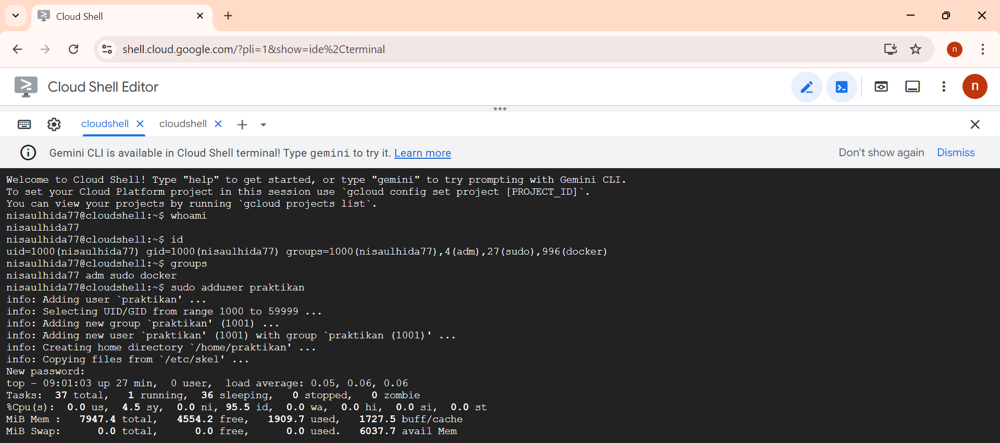
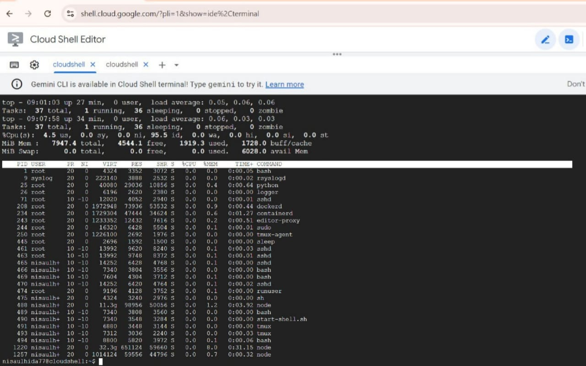
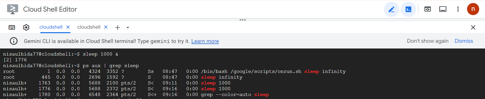
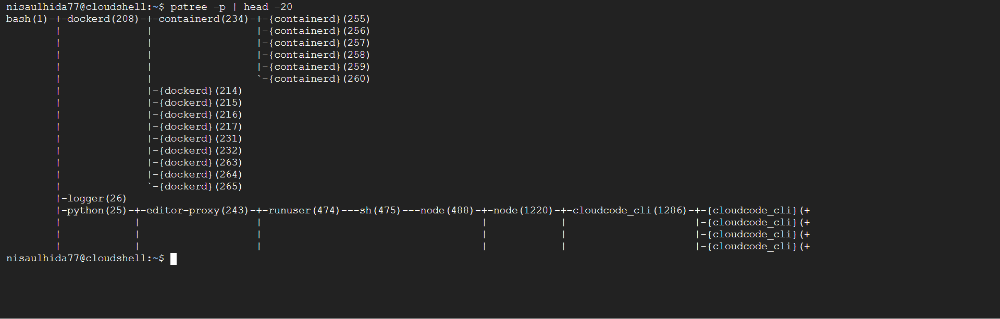

# Laporan Praktikum Minggu [4]
Topik: [Manajemen Proses dan User di Linux]

---

## Identitas
- **Nama**  : [Nisa'ul hidayah]  
- **NIM**   : [250202981]  
- **Kelas** : [1IKRB]

---

## Tujuan  
> Menjelaskan konsep proses dan user dalam sistem operasi Linux.  
> Menampilkan daftar proses yang sedang berjalan dan statusnya.  
> Menggunakan perintah untuk membuat dan mengelola user.  
> Menghentikan atau mengontrol proses tertentu menggunakan PID.  
> Menjelaskan kaitan antara manajemen user dan keamanan sistem.  

---

## Dasar Teori
1. Proses adalah program yang sedang dijalankan di sistem. Linux menyediakan berbagai perintah seperti ps, top, kill, dan pstree untuk mengelola dan memantau proses.Setiap proses memiliki PID (Process ID) unik dan dapat memiliki proses induk (parent) serta proses anak (child).
2. Manajemen user bertujuan untuk mengatur hak akses dan keamanan sistem, dengan memisahkan pengguna berdasarkan peran dan tanggung jawabnya.Setiap user memiliki UID (User ID) dan GID (Group ID) yang digunakan untuk mengatur izin terhadap file, direktori, dan proses.
3. Hubungan Manajemen User dan Keamanan Sistem dengan adanya pembagian user dan grup, Linux memastikan bahwa hanya pengguna tertentu yang dapat mengakses atau mengubah data penting.Hak akses (read, write, execute) menjadi bagian penting untuk menjaga integritas dan kerahasiaan sistem.Sistem sudo memberi kontrol agar hanya user terpercaya yang bisa menjalankan perintah administratif.
---

## Langkah Praktikum
1. **Setup Environment**
   - Gunakan Linux (Ubuntu/WSL).  
   - Pastikan Anda sudah login sebagai user non-root.  
   - Siapkan folder kerja:
     ```
     praktikum/week4-proses-user/
     ```

2. **Eksperimen 1 – Identitas User**
   Jalankan perintah berikut:
   ```bash
   whoami
   id
   groups
   ```
   - Jelaskan setiap output dan fungsinya.  
   - Buat user baru (jika memiliki izin sudo):
     ```bash
     sudo adduser praktikan
     sudo passwd praktikan
     ```
   - Uji login ke user baru.

3. **Eksperimen 2 – Monitoring Proses**
   Jalankan:
   ```bash
   ps aux | head -10
   top -n 1
   ```
   - Jelaskan kolom penting seperti PID, USER, %CPU, %MEM, COMMAND.  
   - Simpan tangkapan layar `top` ke:
     ```
     praktikum/week4-proses-user/screenshots/top.png
     ```

4. **Eksperimen 3 – Kontrol Proses**
   - Jalankan program latar belakang:
     ```bash
     sleep 1000 &
     ps aux | grep sleep
     ```
   - Catat PID proses `sleep`.  
   - Hentikan proses:
     ```bash
     kill <PID>
     ```
   - Pastikan proses telah berhenti dengan `ps aux | grep sleep`.

5. **Eksperimen 4 – Analisis Hierarki Proses**
   Jalankan:
   ```bash
   pstree -p | head -20
   ```
   - Amati hierarki proses dan identifikasi proses induk (`init`/`systemd`).  
   - Catat hasilnya dalam laporan.

6. **Commit & Push**
   ```bash
   git add .
   git commit -m "Minggu 4 - Manajemen Proses & User"
   git push origin main
   ```
---

## Kode / Perintah
Tuliskan potongan kode atau perintah utama:
```bash
   whoami
   id
   groups
   sudo adduser praktikan
   sudo passwd praktikan
   ps aux | head -10
   top -n 1
   sleep 1000 &
   ps aux | grep sleep
   kill <PID>
   pstree -p | head -20
```

---

## Hasil Eksekusi
Sertakan screenshot hasil percobaan atau diagram:





---

## Analisis
- Eksperimen 1

| *Perintah* | *Output* | *Fungsi dan Penjelasan* |
|---------------|------------|-----------------------------|
| whoami | nisaulhida77 | Menampilkan nama user yang sedang login pada sistem saat ini. Dalam hal ini user aktif adalah *nisaulhida77*. |
| id | uid=1000(nisaulhida77) gid=1000(nisaulhida77) groups=1000(nisaulhida77),4(adm),27(sudo),996(docker) | Menampilkan informasi identitas user berupa:<br>• *uid=1000* → ID unik user<br>• *gid=1000* → ID grup utama user<br>• *groups* → daftar grup yang diikuti user (adm, sudo, docker). |
| groups | nisaulhida77 adm sudo docker | Menampilkan daftar grup yang diikuti oleh user *nisaulhida77*. Grup menentukan hak akses dan izin tertentu dalam sistem. |
| sudo adduser praktikan | info: Adding user 'praktikan' ...<br>info: Adding new group 'praktikan' (1001) ...<br>info: Adding new user 'praktikan' (1001) with group 'praktikan' ...<br>Creating home directory '/home/praktikan' ...<br>Copying files from '/etc/skel' ... | Digunakan untuk menambahkan user baru bernama *praktikan* ke dalam sistem. Proses ini juga otomatis membuat:<br>• Grup baru praktikan dengan GID 1001<br>• Home directory /home/praktikan<br>• Menyalin file default dari /etc/skel sebagai konfigurasi awal. |
| (proses input) New password | Pengguna diminta memasukkan password baru | Menentukan password untuk user baru *praktikan* agar bisa login dengan aman. |
| top | (tampilan top) | Menampilkan daftar proses sistem dan penggunaan CPU, RAM, serta swap secara real-time. Perintah ini digunakan untuk memantau kinerja sistem, termasuk jumlah proses yang berjalan dan beban sistem. |

- Eksperimen 2

| *Kolom* | *Penjelasan* |
|------------|----------------|
| *PID* | Nomor unik yang diberikan oleh sistem untuk mengidentifikasi setiap proses yang sedang berjalan. Setiap proses memiliki PID yang berbeda. |
| *USER* | Menunjukkan pemilik proses (user yang menjalankan proses tersebut). Misalnya: *root* (hak akses penuh) atau *nisaulhida77* (user biasa). |
| *%CPU* | Persentase penggunaan CPU oleh proses tersebut. Nilai tinggi berarti proses tersebut sedang memakan banyak sumber daya CPU. |
| *%MEM* | Persentase penggunaan memori (RAM) oleh proses tersebut. Menunjukkan seberapa besar memori yang digunakan dibanding total memori sistem. |
| *COMMAND* | Nama program atau perintah yang sedang dijalankan oleh proses. Contoh: bash, python, node, dockerd, dll. |

- Eksperimen 3

| *Perintah* | *Output  ** | **Penjelasan* |
|---------------|--------------------|---------------------------|
| sleep 1000 & | [2] 1776 | Menjalankan perintah sleep 1000 di background selama 1000 detik. Angka *[2]* adalah nomor job, dan *1776* adalah PID (Process ID) dari proses sleep. |
| ps aux \| grep sleep | Menampilkan daftar proses yang mengandung kata “sleep” | Digunakan untuk memeriksa apakah proses sleep masih berjalan dengan menyaring hasil ps aux menggunakan grep. |
| *PID proses sleep* | 1776 | PID ini adalah identitas unik proses sleep 1000 yang sedang berjalan di background oleh user *nisaulhida77*. |

- Eksperimen 4
Proses induk tertinggi pada hasil pengamatan ini adalah bash(1), dan secara sistem, proses ini berada di bawah init atau systemd, yang berperan sebagai proses induk utama seluruh sistem operasi Linux.

---

## Kesimpulan
1. Linux memiliki sistem manajemen user dan proses terstruktur, di mana setiap user dan proses memiliki identitas dan hak akses yang jelas. 
2. Melalui perintah ps, top, kill, dan pstree, pengguna dapat memantau, mengontrol, dan memahami hubungan antarproses dalam sistem. 
3. Keseluruhan eksperimen menunjukkan bahwa Linux mampu menjaga stabilitas dan keamanan sistem melalui pengelolaan proses dan user secara hierarkis dan terkontrol.

---

### Tugas
1. Dokumentasikan hasil semua perintah dan jelaskan fungsi tiap perintah.

| *Perintah* | *Penjelasan* |
|---------------|----------------|
| whoami | Menampilkan nama user yang sedang login. |
| id | Menampilkan UID (User ID), GID (Group ID), dan daftar grup yang diikuti oleh user. |
| groups | Menunjukkan semua grup yang diikuti user aktif. |
| sudo adduser praktikan | Menambahkan user baru bernama *praktikan* ke dalam sistem beserta direktori home-nya. |
| top | Menampilkan monitoring real-time proses yang sedang berjalan (CPU, memori, dan status). |
| ps aux | Menampilkan daftar semua proses aktif di sistem dengan informasi lengkap. |
| grep | Menyaring output dari perintah lain berdasarkan kata kunci tertentu, misalnya grep sleep untuk mencari proses sleep. |
| sleep 1000 & | Menjalankan proses sleep selama 1000 detik di background. |
| pstree -p | Menampilkan struktur hierarki proses dalam bentuk pohon (tree) dengan PID masing-masing. |  
2. Gambarkan hierarki proses dalam bentuk diagram pohon (`pstree`) di laporan.


```
bash(1)
├─ dockerd(208)
│  ├─ containerd(234)
│  │  ├─ {containerd}(255)
│  │  ├─ {containerd}(256)
│  │  ├─ {containerd}(257)
│  │  ├─ {containerd}(258)
│  │  ├─ {containerd}(259)
│  │  └─ {containerd}(260)
│  ├─ {dockerd}(214)
│  ├─ {dockerd}(215)
│  ├─ {dockerd}(216)
│  ├─ {dockerd}(217)
│  ├─ {dockerd}(231)
│  ├─ {dockerd}(232)
│  ├─ {dockerd}(263)
│  ├─ {dockerd}(264)
│  └─ {dockerd}(265)
│
├─ logger(26)
│
└─ python(25)
   ├─ editor-proxy(243)
   │  └─ runuser(474)
   │     └─ sh(475)
   │        └─ node(488)
   │           ├─ node(1220)
   │           │  └─ cloudcode_cli(1286)
   │           │     ├─ {cloudcode_cli}(…)
   │           │     ├─ {cloudcode_cli}(…)
   │           │     └─ {cloudcode_cli}(…)
```


3. Jelaskan hubungan antara user management dan keamanan sistem Linux. 
Hubungan antara user management dan keamanan sistem Linux yaitu pengelolaan pengguna berfungsi untuk mengatur hak akses, izin, dan peran setiap user agar sistem tetap aman. Dengan manajemen user yang baik, setiap pengguna hanya dapat mengakses file atau perintah sesuai haknya, sehingga mencegah penyalahgunaan, pelanggaran privasi, dan kerusakan sistem. Prinsip ini menjaga stabilitas dan keamanan sistem Linux secara keseluruhan.

## Quiz
1. [Apa fungsi dari proses `init` atau `systemd` dalam sistem Linux?]  
   **Proses init atau systemd dalam sistem Linux meliputi: Menginisialisasi sistem, Menjalankan layanan (daemon) dan proses penting lainnya, serta Menjadi induk dari semua proses lain di sistem Linux (PID = 1).**  
2. [Apa perbedaan antara `kill` dan `killall`?]  
   **Perbedaan antara kill dan killall adalah kill menghentikan proses tertentu berdasarkan PID (Process ID) sementara killall menghentikan semua proses yang memiliki nama program tertentu.**  
3. [Mengapa user `root` memiliki hak istimewa di sistem Linux?]  
   **Karena root adalah superuser dengan akses penuh ke seluruh sistem, termasuk file, konfigurasi, dan proses. Pengguna root dapat menambah, menghapus, atau memodifikasi pengguna lain, mengeksekusi semua perintah tanpa pembatasan, dan sepenuhnya mengontrol pengaturan sistem.**  

---

## Refleksi Diri
Bagian paling menantang dalam praktikum adalah memahami hubungan antarproses dan hierarki proses. Saya kesulitan membaca struktur pohon proses dan membedakan proses induk dan anak. Dengan mempelajari konsep dasar proses di Linux dan menggunakan perintah tambahan, saya bisa mengenali struktur hierarki proses.
---

**Credit:**  
_Template laporan praktikum Sistem Operasi (SO-202501) – Universitas Putra Bangsa_
