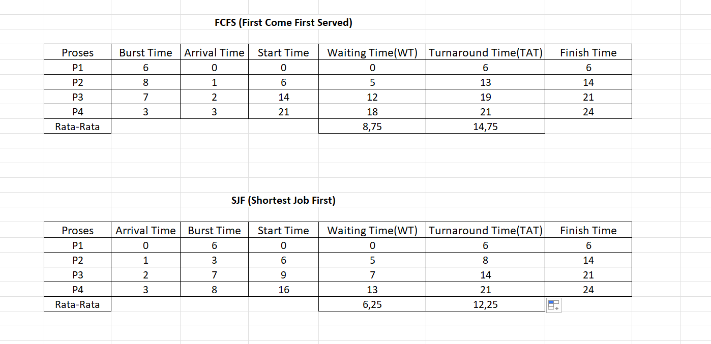
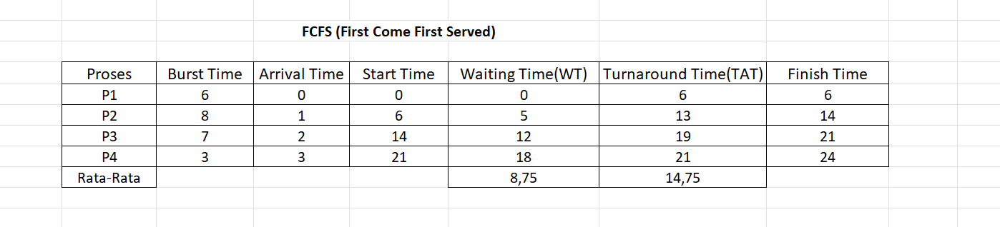
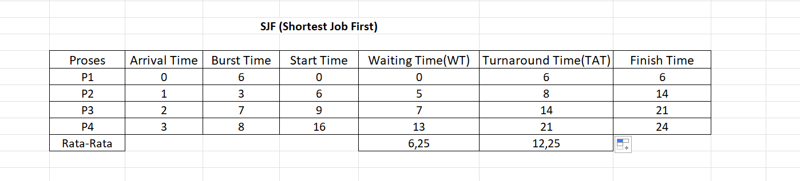

# Laporan Praktikum Minggu [5]
Topik: [Penjadwalan CPU – FCFS dan SJF]

---

## Identitas
- **Nama**  : [Nisa'ul Hidayah]  
- **NIM**   : [250202981]  
- **Kelas** : [1IKRB]

---

## Tujuan
1. Menghitung waiting time dan turnaround time untuk algoritma FCFS dan SJF.
2. Menyajikan hasil perhitungan dalam tabel yang rapi dan mudah dibaca.
3. Membandingkan performa FCFS dan SJF berdasarkan hasil analisis.
4. Menjelaskan kelebihan dan kekurangan masing-masing algoritma.
5. Menyimpulkan kapan algoritma FCFS atau SJF lebih sesuai digunakan.

---

## Dasar Teori
1. Penjadwalan CPU adalah proses yang dilakukan sistem operasi untuk menentukan urutan eksekusi proses di CPU agar penggunaan prosesor menjadi efisien dan adil.
2. Algoritma FCFS (First Come First Served) merupakan proses dieksekusi berdasarkan urutan kedatangan proses yang datang lebih dulu dijalankan terlebih dahulu.Metode ini sederhana namun dapat menyebabkan waktu tunggu lebih lama bila ada proses berdurasi panjang.
3. Algoritma SJF (Shortest Job First) merupakan proses dengan waktu eksekusi (burst time) paling pendek diprioritaskan.Algoritma ini memberikan rata-rata waktu tunggu terendah, tetapi dapat menyebabkan proses panjang tertunda jika proses pendek terus berdatangan.

---

## Langkah Praktikum
1. **Siapkan Data Proses**
   Gunakan tabel proses berikut sebagai contoh (boleh dimodifikasi dengan data baru):
   | Proses | Burst Time | Arrival Time |
   |:--:|:--:|:--:|
   | P1 | 6 | 0 |
   | P2 | 8 | 1 |
   | P3 | 7 | 2 |
   | P4 | 3 | 3 |

2. **Eksperimen 1 – FCFS (First Come First Served)**
   - Urutkan proses berdasarkan *Arrival Time*.  
   - Hitung nilai berikut untuk tiap proses:
     ```
     Waiting Time (WT) = waktu mulai eksekusi - Arrival Time
     Turnaround Time (TAT) = WT + Burst Time
     ```
   - Hitung rata-rata Waiting Time dan Turnaround Time.  
   - Buat Gantt Chart sederhana:  
     ```
     | P1 | P2 | P3 | P4 |
     0    6    14   21   24
     ```

3. **Eksperimen 2 – SJF (Shortest Job First)**
   - Urutkan proses berdasarkan *Burst Time* terpendek (dengan memperhatikan waktu kedatangan).  
   - Lakukan perhitungan WT dan TAT seperti langkah sebelumnya.  
   - Bandingkan hasil FCFS dan SJF pada tabel berikut:

     | Algoritma | Avg Waiting Time | Avg Turnaround Time | Kelebihan | Kekurangan |
     |------------|------------------|----------------------|------------|-------------|
     | FCFS | ... | ... | Sederhana dan mudah diterapkan | Tidak efisien untuk proses panjang |
     | SJF | ... | ... | Optimal untuk job pendek | Menyebabkan *starvation* pada job panjang |

4. **Eksperimen 3 – Visualisasi Spreadsheet (Opsional)**
   - Gunakan Excel/Google Sheets untuk membuat perhitungan otomatis:
     - Kolom: Arrival, Burst, Start, Waiting, Turnaround, Finish.
     - Gunakan formula dasar penjumlahan/subtraksi.
   - Screenshot hasil perhitungan dan simpan di:
     ```
     praktikum/week5-scheduling-fcfs-sjf/screenshots/
     ```

5. **Analisis**
   - Bandingkan hasil rata-rata WT dan TAT antara FCFS & SJF.  
   - Jelaskan kondisi kapan SJF lebih unggul dari FCFS dan sebaliknya.  
   - Tambahkan kesimpulan singkat di akhir laporan.

6. **Commit & Push**
   ```bash
   git add .
   git commit -m "Minggu 5 - CPU Scheduling FCFS & SJF"
   git push origin main
   ```
---

## Kode / Perintah
Tuliskan potongan kode atau perintah utama:
| Proses | Burst Time | Arrival Time |
   |:--:|:--:|:--:|
   | P1 | 6 | 0 |
   | P2 | 8 | 1 |
   | P3 | 7 | 2 |
   | P4 | 3 | 3 |
 ```
     Waiting Time (WT) = waktu mulai eksekusi - Arrival Time
     Turnaround Time (TAT) = WT + Burst Time
 ```
 ```
     | P1 | P2 | P3 | P4 |
     0    6    14   21   24
```
```
     | P1 | P2 | P3 | P4 |
     0    6    9   16   24
```

---

## Hasil Eksekusi
Sertakan screenshot hasil percobaan atau diagram:

>Eksperimen 1

```
     | P1 | P2 | P3 | P4 |
     0    6    14   21   24
```
> Eksperimen 2

```
     | P1 | P2 | P3 | P4 |
     0    6    9   16   24
```

| Algoritma | Avg Waiting Time | Avg Turnaround Time | Kelebihan | Kekurangan |
|------------|------------------|----------------------|------------|-------------|
| FCFS | 8,75 | 14,75 | Sederhana dan mudah diterapkan | Tidak efisien untuk proses panjang |
| SJF | 6,25 | 12,25 | Optimal untuk job pendek | Menyebabkan *starvation* pada job panjang |


---

## Analisis
- Perbandingan hasil rata-rata WT dan TAT antara FCFS & SJF.
Rata-rata Waiting Time (WT) algoritma SJF (Shortest Job First) [6,25] sedangkan algoritma FCFS (First Come First Served) [8,75] 
Rata-rata Turnaround Time (TAT) algoritma SJF (Shortest Job First) [12,25] sedangkan algoritma FCFS (First Come First Served) [14,75]
SJF menghasilkan waktu tunggu (WT) dan turnaround time (TAT) rata-rata lebih kecil dibandingkan dengan FCFS, yang artinya SJF lebih efisien jika proses pendek sering muncul. 

- Jelaskan kondisi kapan SJF lebih unggul dari FCFS dan sebaliknya.
SJF lebih unggul dari FCFS ketika sistem memiliki banyak proses waktu berdurasi pendek, karena SJF dapat meminimalkan rata-rata waktu tunggu dan efisiensi.
FCFS lebih unggul dari FCFS jika proses datang secara berurutan dan memiliki durasi hampir sama, atau ketika keadilan (urutan sesuai kedatangan) lebih penting daripada efisiensi. 

- Kesimpulan 
FCFS mudah diterapkan namun kurang efisien, sedangkan SJF memberikan performa lebih baik namun bisa menyebabkan keterlambatan proses panjang.  

---

## Kesimpulan
1. Algoritma SJF menghasilkan waktu tunggu (Waiting Time) dan waktu penyelesaian (Turnaround Time) rata-rata yang lebih kecil dibandingkan FCFS, sehingga lebih efisien dalam penggunaan CPU.
2. FCFS mudah diterapkan dan bersifat adil berdasarkan urutan kedatangan, namun kurang optimal ketika terdapat proses dengan waktu eksekusi yang panjang.

---

## Quiz
1. [Apa perbedaan utama antara FCFS dan SJF?]  
   **Perbedaan utama antara FCFS dan SJF adalah FCFS (First Come First Served) mengeksekusi proses berdasarkan urutan kedatangan tanpa memperhatikan lama waktu eksekusi, sedangkan SJF (Shortest Job First) memilih proses dengan waktu eksekusi paling pendek untuk dijalankan lebih dulu.**  
2. [Mengapa SJF dapat menghasilkan rata-rata waktu tunggu minimum?]  
   **Karena SJF selalu mengeksekusi proses yang membutuhkan waktu paling singkat atau pendek terlebih dahulu, sehingga proses proses kecil tidak menunggu lama.Hal ini membuat total waktu tunggu seluruh proses menjadi lebih kecil dibandingkan algoritma lain seperti FCFS.**  
3. [Apa kelemahan SJF jika diterapkan pada sistem interaktif?]  
   **Sulit memperkirakan burst time secara akurat pada sistem nyata, dapat menyebabkan kelaparan bagi proses berdurasi panjang karena proses pendek terus mendapat prioritas, dan tidak cocok untuk sistem interaktif yang memerlukan respon cepat dan adil untuk setiap permintaan pengguna.**  

---

## Refleksi Diri
Bagian tersulit dalam praktikum minggu ini adalah mempelajari dan memahami penghitungan waiting time dan turnaround time setiap algoritma dengan benar, khususnya dalam menentukan urutan eksekusi proses pada SJF. Untuk mengatasinya, saya mempelajari kembali konsep dasar penjadwalan CPU, dengan lebih sistematis dalam setiap langkah perhitungan.

---

**Credit:**  
_Template laporan praktikum Sistem Operasi (SO-202501) – Universitas Putra Bangsa_
