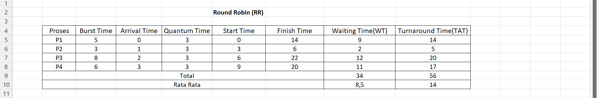
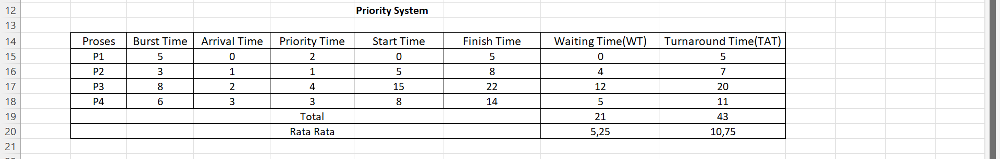

# Laporan Praktikum Minggu [6]
Topik: [Penjadwalan CPU – Round Robin (RR) dan Priority Scheduling]

---

## Identitas
- **Nama**  : [Nisa'ul Hidayah]  
- **NIM**   : [250202981]  
- **Kelas** : [1IKRB]

---

## Tujuan
1. Menghitung *waiting time* dan *turnaround time* pada algoritma RR dan Priority.  
2. Menyusun tabel hasil perhitungan dengan benar dan sistematis.  
3. Membandingkan performa algoritma RR dan Priority.  
4. Menjelaskan pengaruh *time quantum* dan prioritas terhadap keadilan eksekusi proses.  
5. Menarik kesimpulan mengenai efisiensi dan keadilan kedua algoritma.  

---

## Dasar Teori
1. Round Robin adalah algoritma penjadwalan preemptive yang membagi waktu CPU dengan cara bergantian pada proses dalam antrian. Setiap proses mendapatkan potongan waktu (kuantum waktu) tetapi jika waktu habis dan proses belum selesai, proses tersebut kembali ke antrean.
2. Semua proses round robin mendapatkan keadilan karena memiliki kesempatan yang sama untuk berjalan, cocok untuk sistem time sharing. Ini meningkatkan responsivitas untuk tugas interaktif.
3. Prioritas scheduling mengalokasikan CPU tergantung pada nilai prioritas proses (nilai yang lebih tinggi diproses terlebih dahulu). Jenis ini bisa bersifat preemptive atau non preemptive. 

---

## Langkah Praktikum
1. **Siapkan Data Proses**
   Gunakan contoh data berikut (boleh dimodifikasi sesuai kebutuhan):
   | Proses | Burst Time | Arrival Time | Priority |
   |:--:|:--:|:--:|:--:|
   | P1 | 5 | 0 | 2 |
   | P2 | 3 | 1 | 1 |
   | P3 | 8 | 2 | 4 |
   | P4 | 6 | 3 | 3 |

2. **Eksperimen 1 – Round Robin (RR)**
   - Gunakan *time quantum (q)* = 3.  
   - Hitung *waiting time* dan *turnaround time* untuk tiap proses.  
   - Simulasikan eksekusi menggunakan Gantt Chart (manual atau spreadsheet).  
     ```
     | P1 | P2 | P3 | P4 | P1 | P3 | ...
     0    3    6    9   12   15   18  ...
     ```
   - Catat sisa *burst time* tiap putaran.

3. **Eksperimen 2 – Priority Scheduling (Non-Preemptive)**
   - Urutkan proses berdasarkan nilai prioritas (angka kecil = prioritas tinggi).  
   - Lakukan perhitungan manual untuk:
     ```
     WT[i] = waktu mulai eksekusi - Arrival[i]
     TAT[i] = WT[i] + Burst[i]
     ```
   - Buat tabel perbandingan hasil RR dan Priority.

4. **Eksperimen 3 – Analisis Variasi Time Quantum (Opsional)**
   - Ubah *quantum* menjadi 2 dan 5.  
   - Amati perubahan nilai rata-rata *waiting time* dan *turnaround time*.  
   - Buat tabel perbandingan efek *quantum*.

5. **Eksperimen 4 – Dokumentasi**
   - Simpan semua hasil tabel dan screenshot ke:
     ```
     praktikum/week6-scheduling-rr-priority/screenshots/
     ```
   - Buat tabel perbandingan seperti berikut:

     | Algoritma | Avg Waiting Time | Avg Turnaround Time | Kelebihan | Kekurangan |
     |------------|------------------|----------------------|------------|-------------|
     | RR | ... | ... | Adil terhadap semua proses | Tidak efisien jika quantum tidak tepat |
     | Priority | ... | ... | Efisien untuk proses penting | Potensi *starvation* pada prioritas rendah |

6. **Commit & Push**
   ```bash
   git add .
   git commit -m "Minggu 6 - CPU Scheduling RR & Priority"
   git push origin main
   ```

---

## Kode / Perintah
| Proses | Burst Time | Arrival Time | Priority |
   |:--:|:--:|:--:|:--:|
   | P1 | 5 | 0 | 2 |
   | P2 | 3 | 1 | 1 |
   | P3 | 8 | 2 | 4 |
   | P4 | 6 | 3 | 3 |
 ```
     | P1 | P2 | P3 | P4 | P1 | P3 | ...
     0    3    6    9   12   15   18  ...
```
 ```
     WT[i] = waktu mulai eksekusi - Arrival[i]
     TAT[i] = WT[i] + Burst[i]
 ```


---

## Hasil Eksekusi
# Eksperimen 1 – Round Robin (RR)

- Sisa *burst time* tiap putaran:

| Proses |Burts Time Awal| Putaran 1 | Putaran 2 | Putaran 3 |
|--------|--------|-----------|-----------|-----------|
| P1     |  5  |   2     |    0      |     -     |
| P2     |  3  |   0     |    -      |     -     |
| P3     |  8  |   5     |    2      |     0     |
| P4     |  6  |   3     |    0      |     -     |

Gantt Chart
 ```
     | P1 | P2 | P3 | P4 | P1 | P3 | P4 | P3 |
     0    3    6    9   12   14   17   20   22
```
# Eksperimen 2 – Priority Scheduling (Non-Preemptive)

Gantt Chart
 ```
     | P1 | P2 | P4 | P3 |
     0    5    8    14   22   
```
# Eksperimen 3 – Analisis Variasi Time Quantum (Opsional)
- Quantum = 2

| Proses | Arrival Time | Burst Time | Finish Time | Turnaround (TAT) | Waiting (WT) |
|--------|---------|-------|------------|-----------|--------------|
| P1     |  0   |  5   |   14    |   14   |  9    |
| P2     |  1   |  3   |   11    |   10   |  7    |
| P3     |  2   |  8   |   22    |   20   |  12   |
| P4     |  3   |  6   |   20    |   17   |  11   |
- Rata Rata WT = 9.75
- Rata Rata TAT = 15.25
> Gantt Chart
```
     | P1 | P2 | P3 | P1 | P4 | P2 | P3 | P1 | P4 | P3 | P4 | P3 |
     0    2    4    6    8    10   11   13   14   16  18   20   22
```
- Quantum = 5

| Proses | Arrival Time | Burst Time | Finish Time | Turnaround (TAT) | Waiting (WT) |
|--------|---------|-------|----------|------------|-----------|
| P1     |    0    |   5   |     5      |     5     |    0  |
| P2     |    1    |   3   |     8      |     7     |    4  |
| P3     |    2    |   8   |    21      |    19     |   11  |
| P4     |    3    |   6   |    22      |    19     |   13  |
- Rata Rata WT = 7.00
- Rata Rata TAT = 12.50
> Gantt Chart
```
     | P1 | P2 | P3 | P4 | P3 | P4 | 
     0    5    8    13   18   21   22
```
- Perbandingan Efek Quantum

| Quantum | Rata-rata Waiting Time (WT) | Rata-rata Turnaround Time (TAT) | Analisis Pengaruh |
|---------|------------------------------|----------------------------------|--------------------|
| 2       |         9.75              |      15.25            | Sangat adil, context switching sangat sering, menyebabkan overhead CPU meningkat. |
| 3       |         8.50              |      14.00            | Masih adil, tetapi lebih efisien. |
| 5       |         7.00              |      12.50            | Context switching sedikit, lebih efisiensi untuk proses besar. |
# Eksperimen 4 - Tabel Perbandingan
| Algoritma | Avg Waiting Time | Avg Turnaround Time | Kelebihan | Kekurangan |
|------------|------------------|----------------------|------------|-------------|
| RR | 8,5 | 14 | Adil terhadap semua proses | Tidak efisien jika quantum tidak tepat |
| Priority | 5,25 | 10,75 | Efisien untuk proses penting | Potensi *starvation* pada prioritas rendah |

---

## Analisis
- Percobaan Round Robin bertujuan untuk memahami cara sistem operasi membagi waktu CPU dengan cara yang adil menggunakan time quantum. Melalui percobaan ini, terlihat bahwa setiap proses mendapat giliran eksekusi secara bergantian, sehingga menggambarkan prinsip keadilan. Percobaan ini juga menunjukkan bahwa besar kecilnya quantum mempengaruhi responsivitas dan jumlah context switching  quantum kecil lebih responsif tetapi kurang efisien, sedangkan quantum besar lebih efisien namun kurang responsif. 
- Percobaan Priority Scheduling menunjukkan bagaimana proses dieksekusi berdasarkan tingkat prioritas, bukan urutan kedatangan. Percobaan ini membantu memahami bahwa proses dengan prioritas lebih tinggi selalu dijalankan terlebih dahulu. Selain itu, percobaan ini memperhatikan potensi starvation pada proses berprioritas rendah, sehingga penting untuk memahami konsep aging sebagai solusi.

---

## Kesimpulan
1. Setiap algoritma penjadwalan memiliki keunggulan dan kelemahannya masing-masing, sehingga pemilihan algoritma harus disesuaikan dengan kebutuhan sistem. Misalnya, Round Robin cocok untuk sistem time sharing.
2. Hasil eksperimen menunjukkan bahwa perbedaan algoritma secara langsung mempengaruhi waktu tunggu dan turnaround time, sehingga analisis kinerja sangat penting untuk memahami perilaku CPU.

---

## Quiz
1. [Apa perbedaan utama antara Round Robin dan Priority Scheduling?]  
   **Perbedaan utamanya round robin dengan priority time adalah round robin memberikan jatah waktu (quantum) yang sama pada setiap prosesnya, sedangkan priority scheduling mengeksekusi proses berdasarkan tingkat prioritasnya.**  
2. [Apa pengaruh besar/kecilnya *time quantum* terhadap performa sistem?]  
   **Pengaruh quantum jika terlalu kecil akan mengakibatkan CPU terlalu sering melakukan context switching, menyebabkan overhead tinggi dan menurunkan performa. Sedangkan jika quantum terlalu besar akan mengakibatkan sistem menjadi kurang responsif, sehingga waktu tunggu proses interaktif meningkat.**  
3. [Mengapa algoritma Priority dapat menyebabkan *starvation*?]  
   **Algoritma Priority dapat menyebabkan starvation dikarenakan proses dengan prioritas rendah dapat terus tertunda dan tidak pernah mendapat giliran, menyebabkan proses berprioritas rendah menunggu dengan sangat lama atau bisa jadi tidak pernah dieksekusi sama sekali.**  

---

## Refleksi Diri
Bagian yang paling menantang dalam praktikum ini adalah membedakan karakteristik kinerja masing masing algoritma penjadwalan, karena setiap algoritma memiliki aturan yang berbeda. Untuk mengatasinya, saya mempelajari kembali langkah perhitungan secara bertahap.

---

**Credit:**  
_Template laporan praktikum Sistem Operasi (SO-202501) – Universitas Putra Bangsa_
