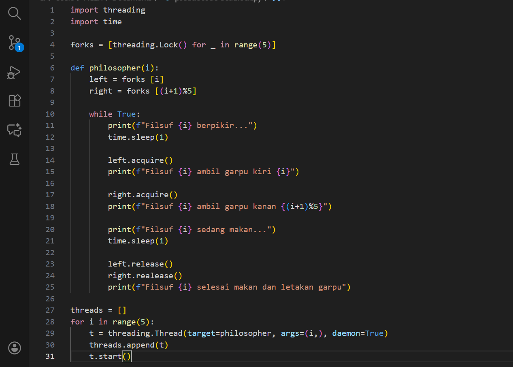
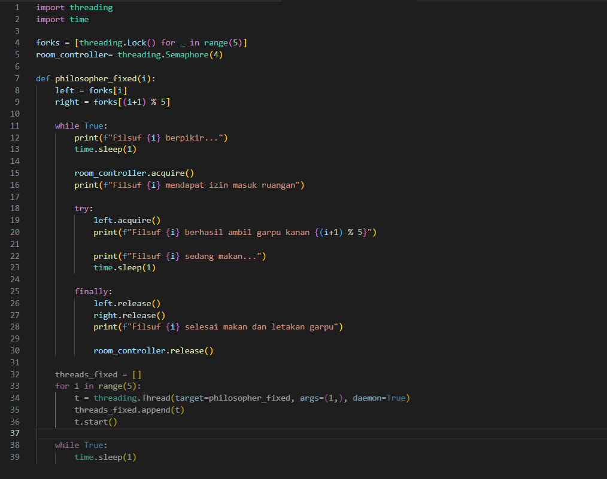

# Laporan Praktikum Minggu [7]
Topik: [Sinkronisasi Proses dan Masalah Deadlock]

---

## Identitas
- **Nama**  : [Nisa'ul Hidayah]  
- **NIM**   : [250202981]  
- **Kelas** : [1IKRB]
- **Nama Anggota** :
- Dyah Retno Wulandari (250202934) 
- Latifah Risti Anggraeni (250202945) 
- Nisa'ul Hidayah (250202981) 
---

## Tujuan
1. Mengidentifikasi empat kondisi penyebab deadlock (*mutual exclusion, hold and wait, no preemption, circular wait*).  
2. Menjelaskan mekanisme sinkronisasi menggunakan *semaphore* atau *monitor*.  
3. Menganalisis dan memberikan solusi untuk kasus deadlock.  
4. Berkolaborasi dalam tim untuk menyusun laporan analisis.  
5. Menyajikan hasil studi kasus secara sistematis.  


---

## Dasar Teori
Sinkronisasi proses adalah cara komputer mengatur beberapa proses (program yang sednag berejalan) agar tidaksaling bentrok ketika memakai resource yang sama. Masalah deadlock adalah kondisi ketika dua atau lebih proses saling menunggu saty samsa lain,sehungga semuanya tidak bisa lanjut semuanya.

---

## Langkah Praktikum
1. **Persiapan Tim**
   - Bentuk kelompok beranggotakan 3–4 orang.  
   - Tentukan ketua dan pembagian tugas (analisis, implementasi, dokumentasi).

2. **Eksperimen 1 – Simulasi Dining Philosophers (Deadlock Version)**
   - Implementasikan versi sederhana dari masalah *Dining Philosophers* tanpa mekanisme pencegahan deadlock.  
   - Contoh pseudocode:
     ```text
     while true:
       think()
       pick_left_fork()
       pick_right_fork()
       eat()
       put_left_fork()
       put_right_fork()
     ```
   - Jalankan simulasi atau analisis alur (boleh menggunakan pseudocode atau diagram alur).  
   - Identifikasi kapan dan mengapa deadlock terjadi.

3. **Eksperimen 2 – Versi Fixed (Menggunakan Semaphore / Monitor)**
   - Modifikasi pseudocode agar deadlock tidak terjadi, misalnya:
     - Menggunakan *semaphore (mutex)* untuk mengontrol akses.
     - Membatasi jumlah filosof yang dapat makan bersamaan (max 4).  
     - Mengatur urutan pengambilan garpu (misal, filosof terakhir mengambil secara terbalik).  
   - Analisis hasil modifikasi dan buktikan bahwa deadlock telah dihindari.

4. **Eksperimen 3 – Analisis Deadlock**
   - Jelaskan empat kondisi deadlock dari versi pertama dan bagaimana kondisi tersebut dipecahkan pada versi fixed.  
   - Sajikan hasil analisis dalam tabel seperti contoh berikut:

     | Kondisi Deadlock | Terjadi di Versi Deadlock | Solusi di Versi Fixed |
     |------------------|---------------------------|------------------------|
     | Mutual Exclusion | Ya (satu garpu hanya satu proses) | Gunakan semaphore untuk kontrol akses |
     | Hold and Wait | Ya | Hindari proses menahan lebih dari satu sumber daya |
     | No Preemption | Ya | Tidak ada mekanisme pelepasan paksa |
     | Circular Wait | Ya | Ubah urutan pengambilan sumber daya |

5. **Eksperimen 4 – Dokumentasi**
   - Simpan semua diagram, screenshot simulasi, dan hasil diskusi di:
     ```
     praktikum/week7-concurrency-deadlock/screenshots/
     ```
   - Tuliskan laporan kelompok di `laporan.md` (format IMRaD singkat: *Pendahuluan, Metode, Hasil, Analisis, Diskusi*).

6. **Commit & Push**
   ```bash
   git add .
   git commit -m "Minggu 7 - Sinkronisasi Proses & Deadlock"
   git push origin main
   ```

---

## Kode / Perintah
```text
     while true:
       think()
       pick_left_fork()
       pick_right_fork()
       eat()
       put_left_fork()
       put_right_fork()
```

---

## Hasil Eksekusi
Eksperimen 1

Eksperimen 2


---

## Analisis
Eksperimen 1
- Deadlock muncul setelah setiap filsuf berhasil mengambil garpu kiri, lalu semuanya menunggu garpu kanan yang sedang dipegang orang lain.
- Deadlock terjadi karena setiap filsuf mengambil garpu dengan urutan yang sama (kiri dulu, lalu kanan).

Eksperimen 2
- Modifikasi yang memperkenalkan room_controller (Semaphore dengan nilai N-1, yaitu 4) berhasil mencegah deadlock secara efektif.
Mekanisme Pencegahan:
Pembatasan Akses: Semaphore (room_controller) bertindak sebagai pelayan yang membatasi hanya maksimal 4 filsuf yang boleh berada di meja (mencoba mengambil garpu) secara bersamaan.
Pemecah Siklus (Circular Wait): Dengan hanya mengizinkan N-1 filsuf untuk mencoba makan, selalu ada setidaknya satu garpu bebas yang tidak dapat ditahan oleh semua filsuf secara kolektif.
Jaminan Kemajuan: Keterbatasan ini menjamin bahwa filsuf terakhir yang masuk (misalnya P_3, jika 4 filsuf sudah masuk) pasti dapat mengambil kedua garpunya (F_3 dan F_4 dalam contoh ini) tanpa menunggu garpu yang ditahan oleh filsuf lain. 
Setelah filsuf ini selesai, ia melepaskan garpu, memecah rantai tunggu yang ada, dan memungkinkan filsuf lain untuk melanjutkan. Dengan demikian, kondisi Circular Wait dihilangkan, yang merupakan syarat mutlak untuk mencegah deadlock.

Eksperimen 3
- Empat kondisi deadlock pada eksperimen pertama
1. Mutual Exclusion (Mutual Eksklusif)
Setiap garpu hanya bisa dipakai oleh satu filsuf pada satu waktu.
Pada versi pertama, lock membuat garpu hanya dimiliki satu thread.
2. Hold and Wait
Setiap filsuf memegang satu garpu kiri dan kemudian menunggu garpu kanan.
Semua filsuf memegang garpu kiri dan sama-sama menunggu garpu kanan(terjebak).
3. No Preemption (Tidak Bisa Dipaksa Lepas)
Lock tidak bisa dicabut paksa, jika filsuf menunggu, dia harus menunggu sampai garpu dilepas.
Tidak ada mekanisme untuk memaksa seorang filsuf melepaskan garpu.
4. Circular Wait (Menunggu Secara Melingkar)
filsuf 0 menunggu garpu 1,
filsuf 1 menunggu garpu 2,
…
filsuf 4 menunggu garpu 0.
Terjadi rantai menunggu melingkar sehingga semua macet.
- Pada versi fixed menggunakan semaphore(4) untuk membatasi bahwa hanya 4 filsuf yang boleh mencoba makan pada waktu yang sama.

---

## Kesimpulan
Pada versi fixed, strategi sinkronisasi ditambahkan — misalnya dengan semaphore untuk membatasi jumlah filsuf (maks. 4) atau mengubah urutan pengambilan garpu (asymmetric order). Modifikasi ini menghilangkan kondisi Circular Wait, dan sekaligus mengurangi Hold and Wait penuh, sehingga rantai deadlock terputus.

---

## Quiz
1. [Sebutkan empat kondisi utama penyebab deadlock.]  
   **Mutual Exclusion, Hold dan Wait, No Preemption, Circular Wait**  
2. [Mengapa sinkronisasi diperlukan dalam sistem operasi?]  
   **Sinkronisasi diperlukan untuk mencegah inkonsistensi data dan sinkronisasi mengatur jalannya beberapa proses secara bersamaan untuk memastikan urutan eksekusi yang tepat, tanpa sinkronisasi akses bersamaan ke sumber daya bersama dapat menyebabkan data yang tidak konsistensi atau hasil yang tidak terduga.**  
3. [Jelaskan perbedaan antara *semaphore* dan *monitor*.]  
   **Semaphore adalah variabel integer yang digunakan untuk mengontrol akses ke sumber daya bersama melalui operasi wait dan signal.Monitir adalah konstruksi sinkronisasi tingkat tinggi yang mengelompokkan data bersama dan prosedur yang beroperasi, memastikan hanya satu proses yang aktif di dalam monitor pada satu waktu.**  

---

## Refleksi Diri
Tuliskan secara singkat:
- Apa bagian yang paling menantang minggu ini?  
Mengimplentasikan kode dining philoshopers dan menggunakan semaphore dengan benar.
- Bagaimana cara Anda mengatasinya?  
Dengan cara mencari referensi, mencari contoh kode, dan berdiskusi dengan teman sekelompok.

---

**Credit:**  
_Template laporan praktikum Sistem Operasi (SO-202501) – Universitas Putra Bangsa_
