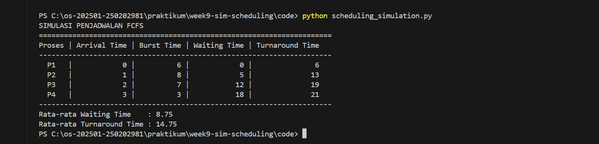

# Laporan Praktikum Minggu [9]
Topik: ["Simulasi Algoritma Penjadwalan CPU"]

---

## Identitas
- **Nama**  : [Nisa'ul Hidayah]  
- **NIM**   : [250202981]  
- **Kelas** : [1IKRB]

---

## Tujuan
1. Membuat program simulasi algoritma penjadwalan FCFS dan/atau SJF.  
2. Menjalankan program dengan dataset uji yang diberikan atau dibuat sendiri.  
3. Menyajikan output simulasi dalam bentuk tabel atau grafik.  
4. Menjelaskan hasil simulasi secara tertulis.  
5. Mengunggah kode dan laporan ke Git repository dengan rapi dan tepat waktu.

---

## Dasar Teori
1. Simulasi algoritma penjadwalan CPU adalah proses pemodelan cara kerja penjadwalan CPU dalam bentuk program untuk meniru urutan eksekusi proses berdasarkan aturan algoritma tertentu, seperti FCFS atau SJF.
   Simulasi umumnya melibatkan algoritma dasar berikut: 
   - First-Come, First-Served (FCFS): Algoritma paling sederhana yang mengeksekusi proses berdasarkan urutan kedatangan (prinsip FIFO).
   - Shortest Job First (SJF): Menjadwalkan proses dengan waktu eksekusi (burst time) CPU terpendek terlebih dahulu, yang secara teoretis menghasilkan kinerja paling efisien dalam waktu tunggu rata-rata.
2. Tujuan dari simulasi digunakan untuk mengevaluasi kinerja algoritma penjadwalan dengan menghitung parameter seperti waiting time dan turnaround time tanpa harus menguji langsung pada sistem operasi nyata.
3. Simulasi memiliki manfaat untuk membantu membandingkan berbagai algoritma penjadwalan secara objektif, meminimalkan kesalahan perhitungan manual, serta mempermudah analisis pada jumlah proses yang besar.

---

## Langkah Praktikum
1. **Menyiapkan Dataset**

   Buat dataset proses minimal berisi:

   | Proses | Arrival Time | Burst Time |
   |:--:|:--:|:--:|
   | P1 | 0 | 6 |
   | P2 | 1 | 8 |
   | P3 | 2 | 7 |
   | P4 | 3 | 3 |

2. **Implementasi Algoritma**

   Program harus:
   - Menghitung *waiting time* dan *turnaround time*.  
   - Mendukung minimal **1 algoritma (FCFS atau SJF non-preemptive)**.  
   - Menampilkan hasil dalam tabel.

3. **Eksekusi & Validasi**

   - Jalankan program menggunakan dataset uji.  
   - Pastikan hasil sesuai dengan perhitungan manual minggu sebelumnya.  
   - Simpan hasil eksekusi (screenshot).

4. **Analisis**

   - Jelaskan alur program.  
   - Bandingkan hasil simulasi dengan perhitungan manual.  
   - Jelaskan kelebihan dan keterbatasan simulasi.

5. **Commit & Push**

   ```bash
   git add .
   git commit -m "Minggu 9 - Simulasi Scheduling CPU"
   git push origin main
   ```

---

## Kode / Perintah
```bash
import csv

data_proses = []
with open('dataset.csv', 'r') as file:
    for b in csv.DictReader(file):
        data_proses.append({
            'proses': b['Process'],
            'arrival_time': int(b['ArrivalTime']),
            'burst_time': int(b['BurstTime'])
        })

data_proses.sort(key=lambda x: x['arrival_time'])

waktu = total_wait = total_ta = 0

print("SIMULASI PENJADWALAN FCFS")
print("Proses | Arrival | Burst | Waiting | Turnaround")

for p in data_proses:
    if waktu < p['arrival_time']:
        waktu = p['arrival_time']
    wait = waktu - p['arrival_time']
    ta = wait + p['burst_time']
    total_wait += wait
    total_ta += ta
    print(f"{p['proses']:>4}   | {p['arrival_time']:>7} | {p['burst_time']:>5} | {wait:>7} | {ta:>10}")
    waktu += p['burst_time']

n = len(data_proses)
print(f"Rata-rata Waiting Time    : {total_wait / n:.2f}")
print(f"Rata-rata Turnaround Time : {total_ta / n:.2f}")
```

---

## Hasil Eksekusi
Output program :


---

## Analisis
- Alur Pogram
1. Membaca dataset dari file CSV.
2. Mengurutkan proses berdasarkan arrival time.
3. Menghitung waiting time setiap proses.
4. Menghitung turnaround time setiap proses.
5. Menampilkan hasil simulasi dalam bentuk tabel.
6. Menghitung rata-rata waiting time dan turnaround time.
- Bandingkan hasil simulasi dengan perhitungan manual.  
```
   Rata-rata Waiting Time    : 8.75
   Rata-rata Turnaround Time : 14.75
```
Hasil simulasi FCFS menunjukan nilai rata-rata waiting time dan rata-rata turnaround time yang sesuai dengan hasil perhitungan manual yang dilakukan pada minggu sebelumnya.
- Kelebihan dan Keterbatasan Simulasi. 
  
   **Kelebihan**
- Mempercepat perhitungan untuk dataset besar
- Mengurangi kesalahan manusia
- Mudah dimodifikasi untuk algoritma lain
  
   **Keterbatasan**
- Tidak mempertimbangkan kondisi sistem nyata
- Tidak menangani preemptive scheduling
- Hanya fokus pada parameter waktu

---

## Kesimpulan
1. Simulasi algoritma penjadwalan CPU mempermudah pemahaman proses perhitungan waiting time dan turnaround time secra sistematis dan akurat.
2. Algoritma FCFS mudah diimplementasikan karena hanya bergantung pada urutan kedatangan proses.
3. Penggunaan simulasi membantu mengurangi kesalahan perhitungan manual.

---

## Quiz
1. [Mengapa simulasi diperlukan untuk menguji algoritma scheduling?]  
   **Jawaban: Simulasi diperlukan untuk memvalidasi algoritma scara cepat dan akurat**  
2. [Apa perbedaan hasil simulasi dengan perhitungan manual jika dataset besar?]  
   **Jawaban: Pada dataset besar, simulasi lebih konsisten dan minim kesalahan, sedangkan perhitungan manual rentan terhadap kesalahan dan memakan wakru yang lama**  
3. [Algoritma mana yang lebih mudah diimplementasikan? Jelaskan.]  
   **Jawaban: Algoritma FCFS lebih mudah di implementasikan karena hanya membutuhkan pengurutan berdasarkan waktu kedatangan tanpa logika pemilihan proses yang kompleks**  

---

## Refleksi Diri
Tuliskan secara singkat:
- Apa bagian yang paling menantang minggu ini?  
Bagian yang paling menantang minggu ini adalah menjalankan program simulasi penjadwalan CPU dengan struktur folder yang benar serta memastikan dile python dapat membaca dataset csv tanpa error.
- Bagaimana cara Anda mengatasinya?  
Cara mengatasinya dengan memahami struktur folder.

---

**Credit:**  
_Template laporan praktikum Sistem Operasi (SO-202501) – Universitas Putra Bangsa_
